# Graphical User Interface Prototype - CURRENT

Authors: Gruppo 11:
 Giacomo Ponzuoli, Alberto Pedalino, Alice Santoro, Mario De Paola

Date: 05/05/2024

Version: v1.0.0

# Contenuto

- [Login](#login)
- [Errore Login: username o password errati](#errore-login-username-o-password-errati)
- [Sign up Customer](#sign-up-customer)
- [Errore Sign up Customer: username già esistente](#errore-sign-up-customer-username-già-esistente)
- [Sign up manager](#sign-up-manager)
- [Errore sign up manager: username già esistente](#errore-sign-up-manager-username-già-esistente)
- [Home Customer](#home-customer)
- [Informazioni utente](#informazioni-utente)
- [Home customer](#home-customer)
- [Ricerca prodotti customer](#ricerca-prodotti-customer)
- [Errore ricerca prodotti customer: nessun risultato](#errore-ricerca-prodotti-customer-nessun-risultato)
- [Errore ricerca prodotti customer: codice errato](#errore-ricerca-prodotti-customer-codice-errato)
- [Errore ricerca prodotti customer: prodotto già in un carrello o già venduto](#errore-ricerca-prodotti-customer-prodotto-già-in-un-carrello-o-già-venduto)
- [Carrello](#carrello)
- [Carrello vuoto](#carrello-vuoto)
- [Carrello: storico](#carrello-storico)
- [Carrello: pagamento carrello corrente](#carrello-pagamento-carrello-corrente)
- [Home Manager](#home-manager)
- [Ricerca prodotti manager](#ricerca-prodotti-manager)
- [Errore ricerca prodotti manager: nessun risultato](#errore-ricerca-prodotti-manager-nessun-risultato)
- [Errore ricerca prodotti manager: codice errato ](#errore-ricerca-prodotti-manager-codice-errato)
- [Errore segna prodotto come venduto: errore data](#errore-segna-prodotto-come-venduto-errore-data)
- [Manager - aggiungi prodotto](#manager---aggiungi-prodotto)
- [Manager -  aggiungi prodotto: errore informazioni inserite](#manager---aggiungi-prodotto-errore-informazioni-inserite)
- [Manager -  registra prodotti in arrivo](#manager---registra-prodotti-in-arrivo)
- [Errore manager - registra prodotti in arrivo](#errore-manager---registra-prodotti-in-arrivo)

# GUI 

## Login
  

 L'interfaccia serve per effettuare il login dell'utente. Vi sono due possibili ruoli di autenticazione: Customer e Manager. Nel caso in cui l'utente non fosse registrato è previsto un collegamento diretto alla pagina di registrazione "Sign Up".

 ## Errore Login: username o password errati

L'interfaccia mostra l'errore generato in fase di login qualora l'utente inserisca username o password non corretti.

## Sign up Customer

L'interfaccia permette ad un utente di registrarsi inserendo username, name, surname e password.

## Errore Sign up Customer: username già esistente

È previsto il messaggio di errore "username already exists" qualora un utente provi a registrarsi con un username già esistente.

## Sign up Manager

L'interfaccia permette ad un utente di registrare un account Manager inserendo username, name, surname e password.
Questa è accessibile solo tramite link interno fornito ai propietari del negozio e non dai clienti dalla pagina pubblica di login.

## Errore Sign up Manager: username già esistente

È stato il messaggio di errore "username already taken" qualora un manager provi a registrarsi con un username già esistente.

## Home Customer

L'interfaccia rappresenta la schermata principale dell'utente customer. I bottoni in alto a destra indicano rispettivamente, da sinistra verso destra, le seguenti azioni: mostra i prodotti presenti, accedi al carrello, accedi alle informazioni sull'account, effettua il logout.

## Informazioni utente
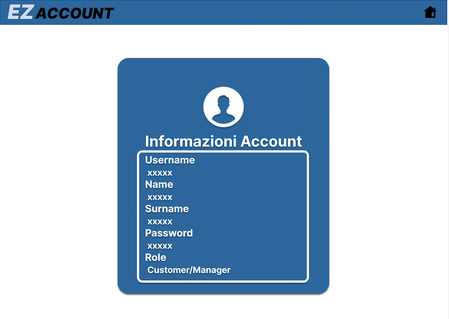

Questa interfaccia permette all'utente di avere riassunti i dati relativi al suo account (username, name, surname password e role). In alto a destra vi è un bottone per tornare alla schermata principale.

## Ricerca prodotti customer
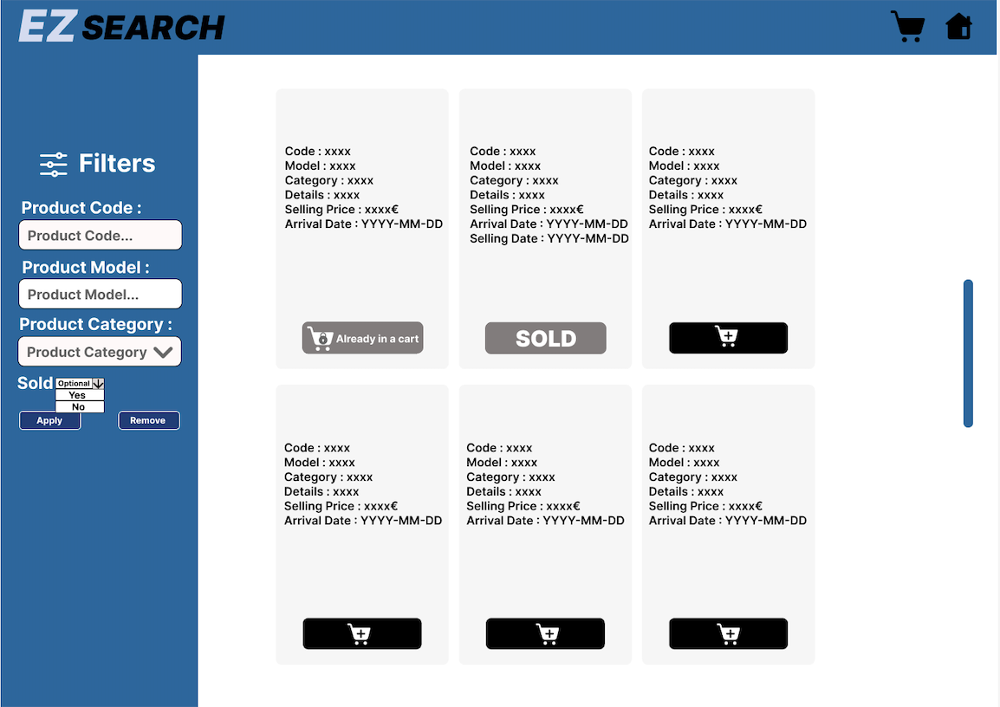

L'interfaccia presenta una tendina sulla sinistra per ricercare un prodotto filtrando per codice, modello o categoria. C'è inoltre un selettore opzionale che permette di visualizzare i prodotti già venduti o non ancora venduti. 
I bottoni "Apply" e "Remove" permettono rispettivamente di applicare o rimuovere i filtri selezionati. 
Nella schermata principale appaiono i prodotti ricercati. Questi sono descritti dai campi code, model, category, details, selling price, arrival date. 
Si possono aggiungere i prodotti al carrello, salvo i casi in cui il prodotto sia stato già venduto (contrassegnato con "SOLD") oppure già aggiunto ad un altro carrello (contrassegnato con "Already in a cart").
I bottoni in alto a destra permettono, rispettivamente da sinistra verso destra, le seguenti azioni: mostra il carrello utente, torna alla pagina principale (home customer).

## Errore Ricerca prodotti customer: nessun risultato
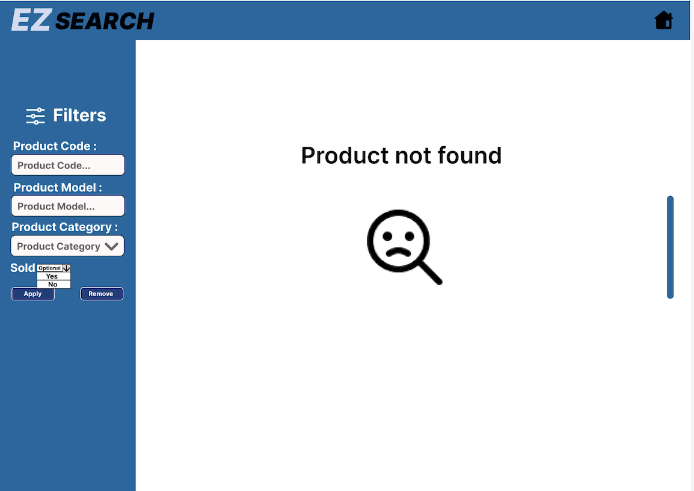

È previsto il messaggio di errore "Product not found" qualora non vi siano prodotti corrispondenti alla ricerca effettuata dall'utente.

## Errore ricerca prodotti customer: codice errato

È previsto un messaggio di errore qualora l'utente inserisca un codice non valido per la ricerca di un prodotto.

## Errore ricerca prodotti customer: prodotto già in un carrello o già venduto

È stato previsto un messaggio di errore qualora l'utente cerchi di aggiungere al carrello un prodotto che è già stato inserito in precedenza in un altro carrello o sia stato già venduto.

## Carrello
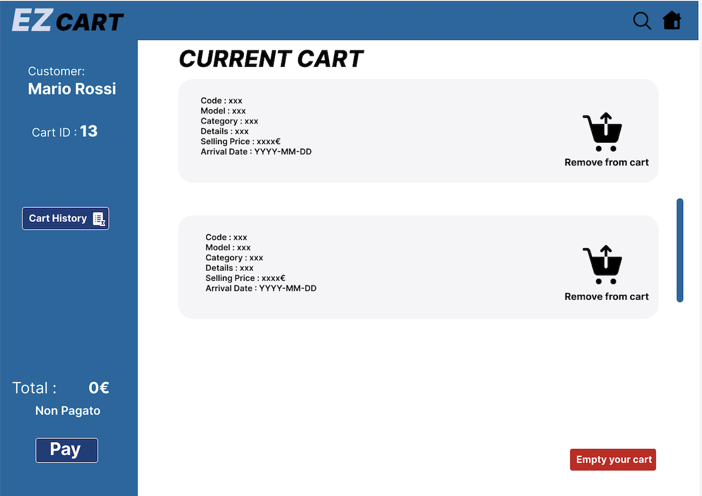

L'interfaccia mostra il carrello corrente dell'utente.
 Nella tendina a sinistra sono indicati name e surname del customer, ID del carrello, prezzo totale e stato del pagamento. Ci sono due bottoni: il primo permette di accedere allo storico dei carrelli,  il secondo di procedere con il pagamento del carrello corrente.
Nella sezione principale ci sono i vari prodotti aggiunti al carrello, ognuno descritto dai campi code, model, category, details, selling price, arrival date. Per ogni prodotto c'è un bottone che permette di rimuoverlo dal carrello. 
In basso a destra c'è un bottone che permette di svuotare il carrello.
I bottoni in alto a destra permettono, rispettivamente da sinistra verso destra, le seguenti azioni: mostra tutti i prodotti, ritorna alla pagina principale (home customer).

## Carrello vuoto
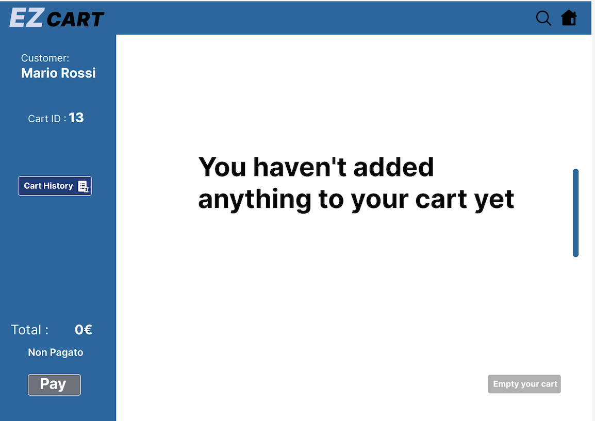

È previsto il messaggio "You haven't added anything to your cart yet" nel caso in cui l'utente acceda al carrello senza aver aggiunto prima alcun prodotto. I bottoni per procedere al pagamento e per svuotare il carrello sono disabilitati.

## Carrello: storico
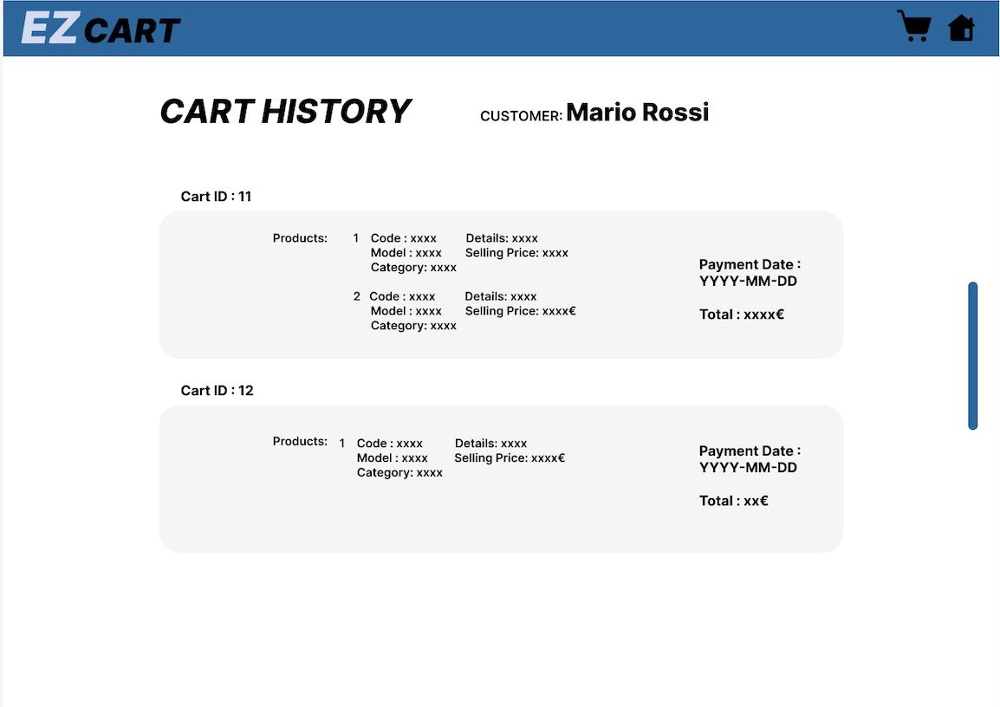

L' interfaccia mostra lo storico dei carrelli dell'utente.
Per ogni carrello sono indicati l'ID, la data del pagamento, l'importo ed i prodotti acquistati. 
Per ogni prodotto acquistato sono specificati il codice, il modello, la categoria, i dettagli e il prezzo di vendita.
Nella pagina sono inoltre indicati nome e cognome del customer.
I bottoni in alto a destra permettono, rispettivamente da sinistra verso destra, le seguenti azioni: mostra il carrello, ritorna alla pagina principale (home customer).

## Carrello: pagamento carrello corrente
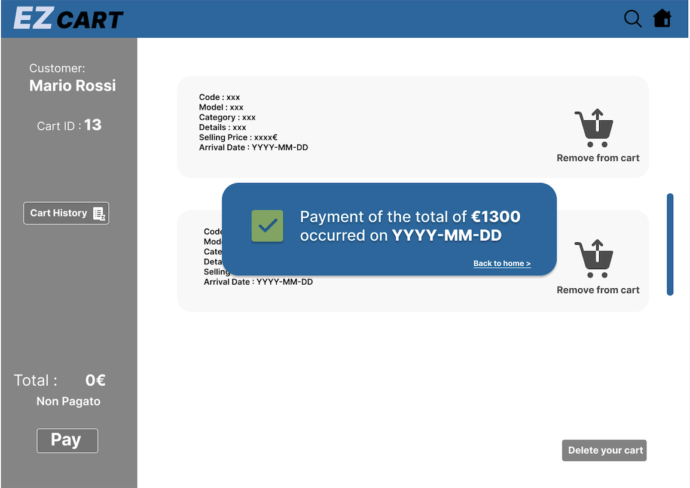

In seguito al pagamento del carrello è previsto un messaggio che indica l'avvenuto pagamento con importo totale e data del pagamento.
 I due bottoni in alto a destra permettono, rispettivamente da sinistra verso destra, le seguenti azioni: mostra i prodotti presenti, ritorna alla paigna principale (home customer).

## Home Manager

L' interfaccia rappresenta la schermata principale dell'utente manager. I bottoni in alto a destra indicano rispettivamente, da sinistra verso destra, le seguenti azioni: 
effettuare una ricerca dei prodotti, consultare la lista utenti, accedere alle informazioni relative al proprio account, effettuare il logout.

## Ricerca prodotti Manager
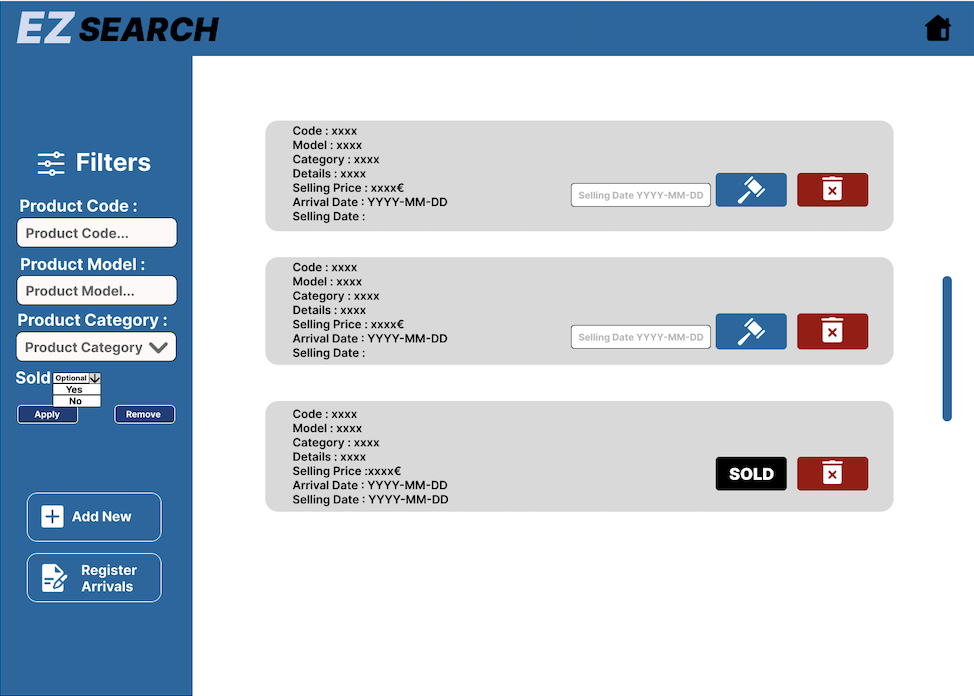

L' interfaccia permette all'utente manager di contrassegnare dei prodotti come venduti o rimuoverli dalla lista dei prodotti. 
Nella tendina sulla sinistra è possibile ricercare un prodotto filtrando per codice, modello o categoria. C'è inoltre un selettore opzionale che permette di visualizzare i prodotti già venduti o non ancora venduti.
 I bottoni "Apply" e "Remove" permettono rispettivamente di applicare o rimuovere i filtri selezionati. Inoltre ci sono due bottoni che permettono di aggiungere un nuovo prodotto e registrare l'arrivo di un set di prodotti. Nella schermata principale vi sono i prodotti cercati. 
 Ogni prodotto è descritto dai campi code, model, category, details, selling price, arrival date. Per ogni prodotto ci sono due bottoni ed una casella di testo dove inserire la data di vendita. Il bottone blu permette di contrassegnare il prodotto come venduto, mentre il bottone rosso permette di rimuovere il prodotto. In alto a destra vi è un bottone che permette di tornare alla pagina principale (home manager).

## Errore ricerca prodotti manager: nessun risultato

È previsto il messaggio "Product not found" qualora non vi siano risultati corrispondenti alla ricerca effettuata dal manager.

## Errore ricerca prodotti manager: codice errato

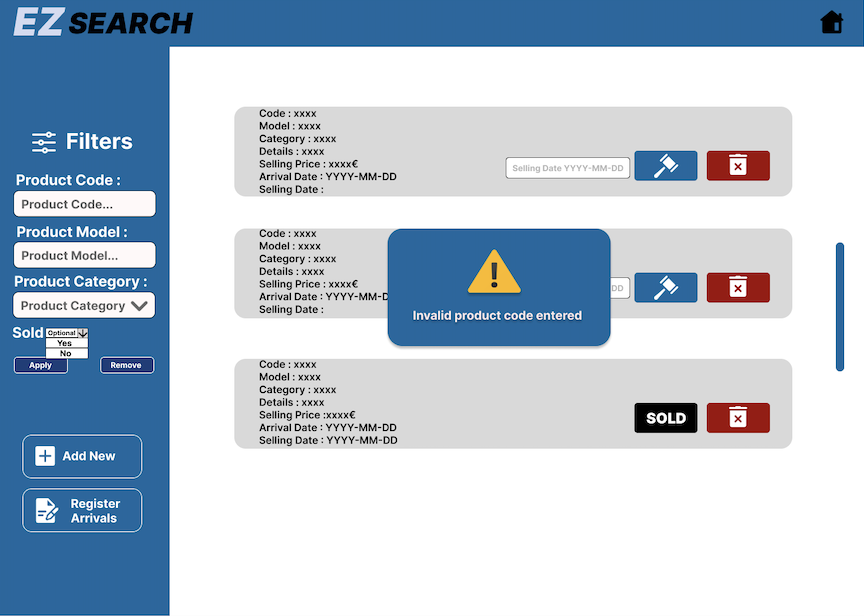

È previsto il messaggio di errore "invalid product code entered" qualora il manager provi ad effettuare una ricerca per codice utilizzando un codice non valido.

## Errore segna prodotto come venduto: errore data
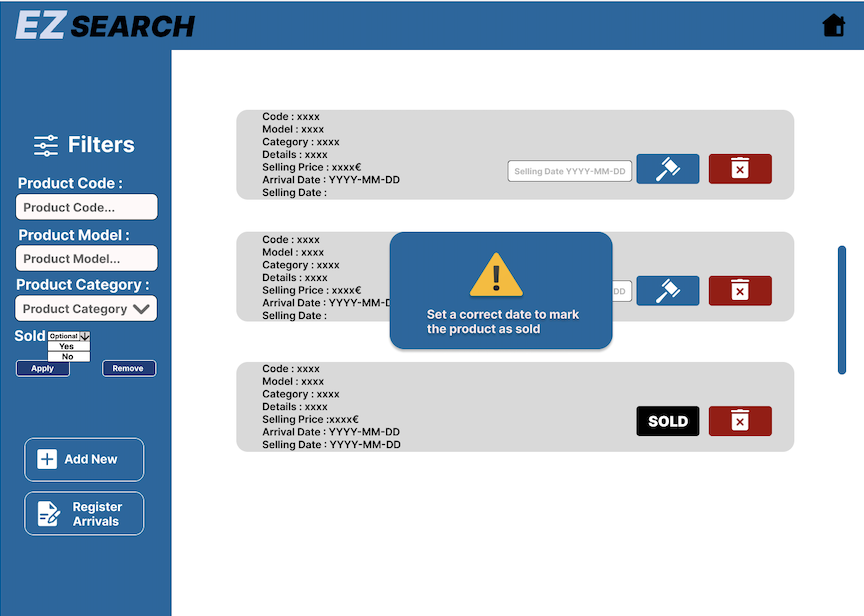

È previsto il messaggio di errore "set a correct date to mark the product as sold" qualora il manager provi ad inserire una data di vendita non valida.

## Manager - aggiungi prodotto
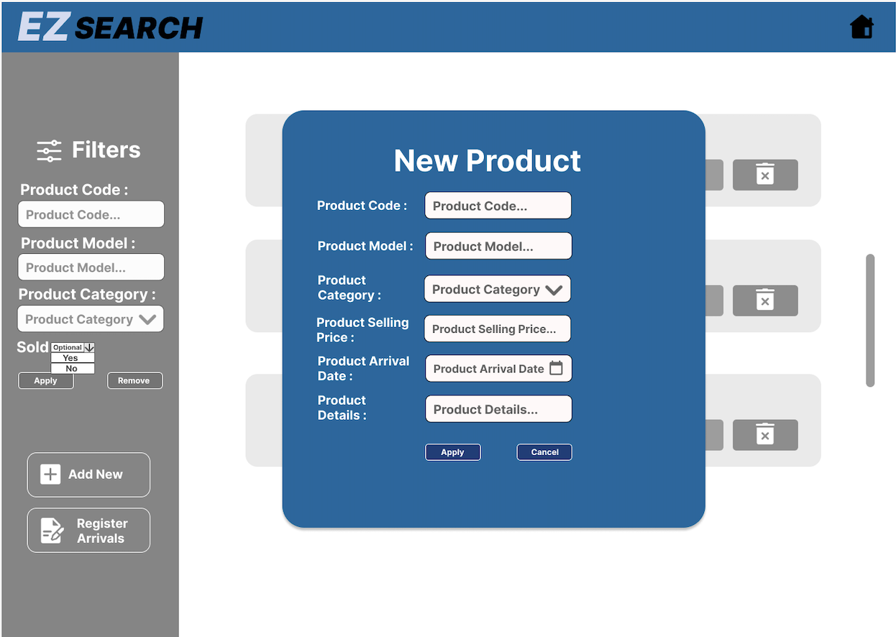

L'interfaccia permette all'utente manager di aggiungere nuovi prodotti alla lista dei prodotti. Una volta cliccato il bottone "Add New" si apre la finestra "New Product". Qui vengono inseriti i campi product code, product model, product category, product selling price, product arrival date, product details. Il bottone "Apply" permette di aggiungere il prodotto alla lista mentre il bottone "Cancel" cancella l'operazione.

## Manager - aggiungi prodotto: errore informazioni inserite 
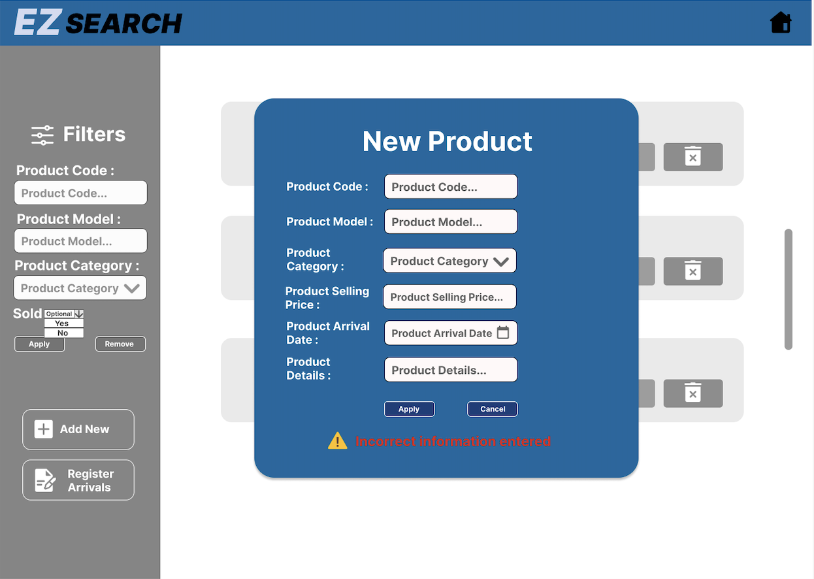

È previsto il messaggio di errore "Incorrect information entered" qualora il manager inserisca delle informazioni non corrette durante l'inserimento del nuovo prodotto.

## Manager - registra prodotti in arrivo
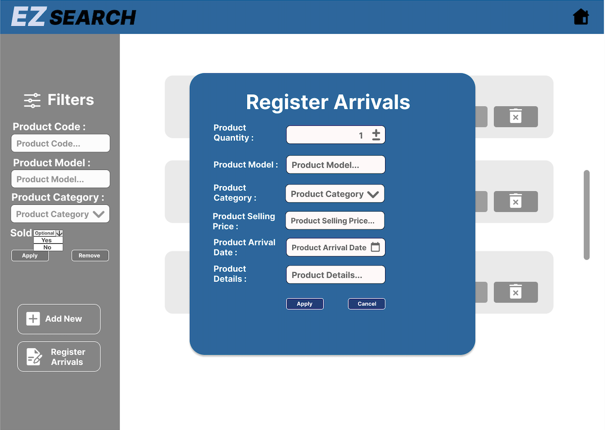

L' interfaccia permette all'utente manager di inserire un set di prodotti. Una volta cliccato il bottone "Register Arrivals" si apre la finestra "Register Arrivals". Qui vengono inseriti i campi product quantity, product model, product category, product selling price, product arrival date, product details. Il bottone "Apply" permette di aggiungere il set di prodotti alla lista dei prodotti mentre il bottone "Cancel" permette di cancellare l'operazione.

## Errore manager - registra prodotti in arrivo
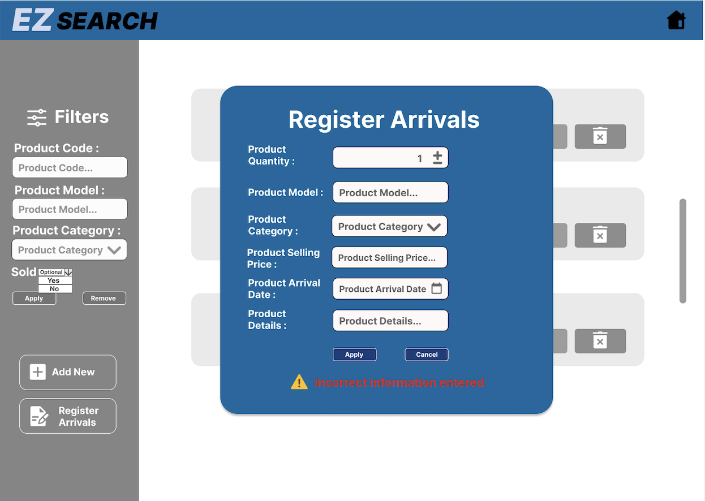

È previsto il messaggio di errore "Incorrect information entered" qualora il manager inserisca delle informazioni non corrette durante l'inserimento del set di prodotti.

