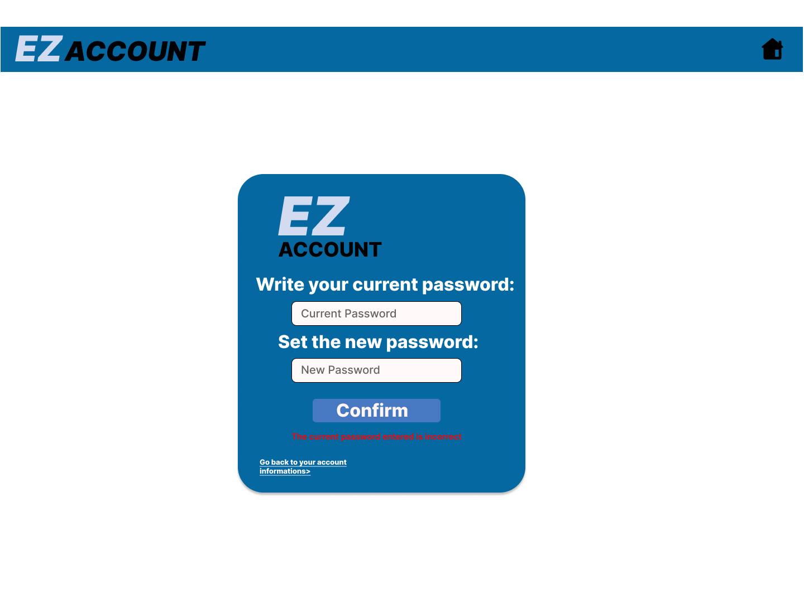
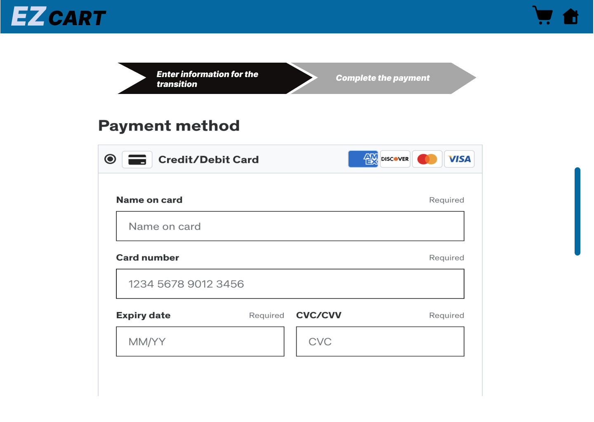
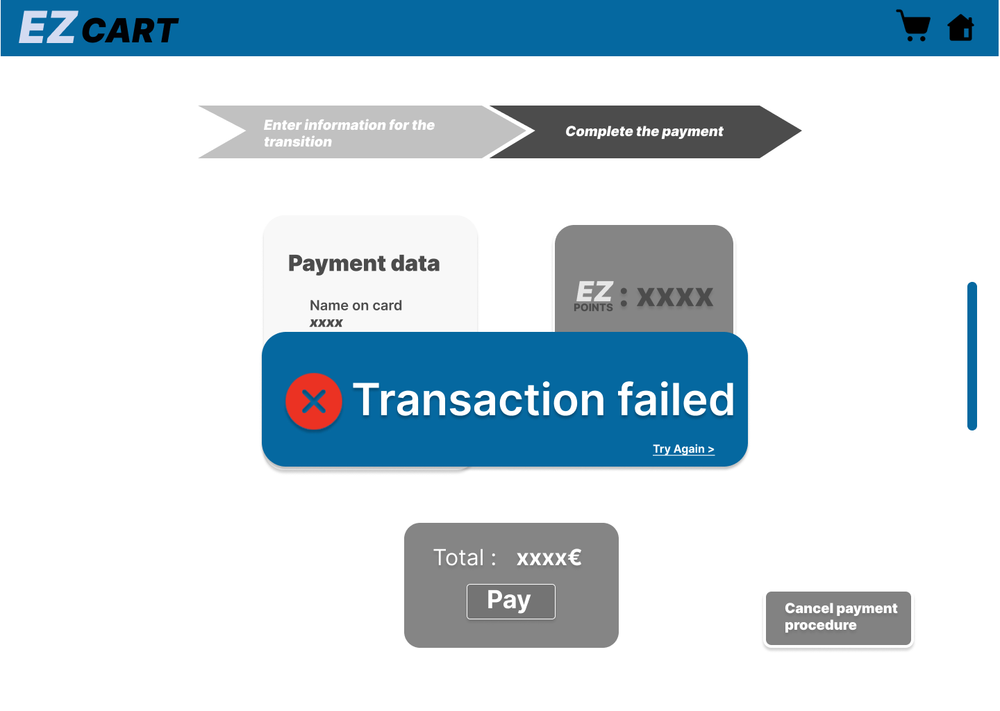
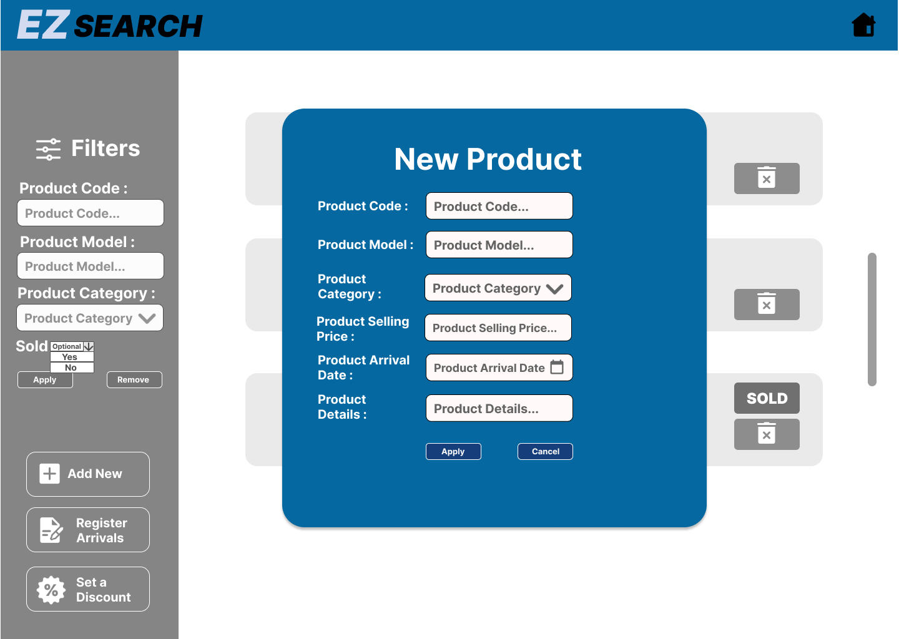
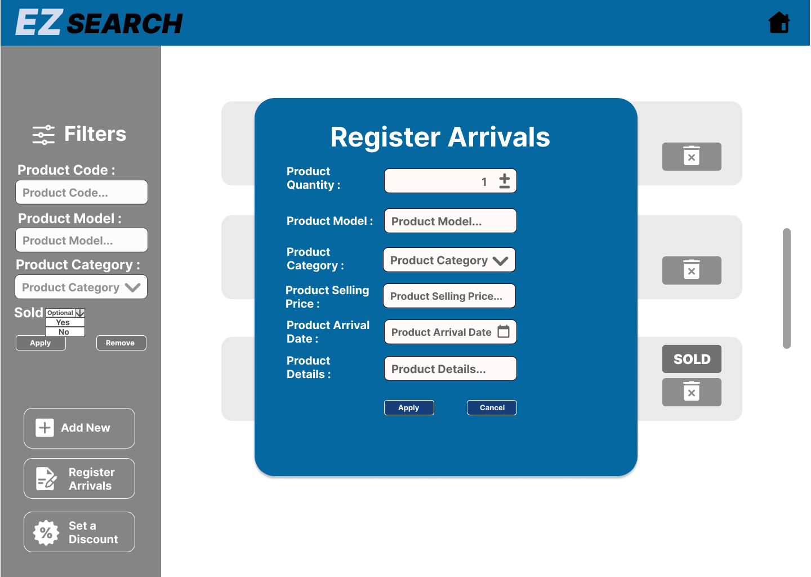

# Graphical User Interface Prototype - FUTURE

Authors: Gruppo 11:
 Mario De Paola, Alberto Pedalino, Giacomo Ponzuoli, Alice Santoro

Date: 05/05/2024

Version: v2.0

# Contenuto

- [Graphical User Interface Prototype - FUTURE](#graphical-user-interface-prototype---future)
- [Contenuto](#contenuto)
- [GUI](#gui)
  - [Login](#login)
  - [Errore login: username o password errati](#errore-login-username-o-password-errati)
  - [Errore login: Account bloccato](#errore-login-account-bloccato)
  - [Sign up Customer](#sign-up-customer)
  - [Errore Sign up Customer: username già esistente](#errore-sign-up-customer-username-già-esistente)
  - [Home Utente non loggato](#home-utente-non-loggato)
  - [Home Customer](#home-customer)
  - [Informazioni account Customer](#informazioni-account-customer)
  - [Informazioni account Manager e Admin](#informazioni-account-manager-e-admin)
  - [Informazioni utente loggato: cambio password](#informazioni-utente-loggato-cambio-password)
  - [Errore informazioni utente loggato: cambio password errato](#errore-informazioni-utente-loggato-cambio-password-errato)
  - [ Informazioni utente loggato: elimina account](#informazioni-utente-loggato-elimina-account)
  - [Errore informazioni utente loggato: eliminazione account fallita](#errore-informazioni-utente-loggato-fallita-eliminazione-account)
  - [Ricerca prodotti Utente e Customer](#ricerca-prodotti-utente-e-customer)
  - [Ricerca prodotti Utente e Customer: nessun risultato](#ricerca-prodotti-utente-e-customer-nessun-risultato)
  - [Errore ricerca prodotti Utente: errore di login](#errore-ricerca-prodotti-utente-errore-di-login)
  - [Errore ricerca prodotti Customer: prodotto già in un carrello o già venduto](#errore-ricerca-prodotti-customer-prodotto-già-in-un-carrello-o-già-venduto)
  - [Errore ricerca prodotti Customer: fallimento aggiunta a preferiti](#errore-ricerca-prodotti-customer-fallimento-aggiunta-a-preferiti)
  - [Preferiti](#preferiti)
  - [Preferiti: nessun risultato](#preferiti-nessun-risultato)
  - [Preferiti errore: prodotto già in un carrello, già venduto, non più presente](#errore-preferiti-prodotto-già-in-un-carrello-già-venduto-non-più-presente)
  - [Recensioni](#recensioni)
  - [Errore recensioni: errore nel login](#errore-recensioni-errore-nel-login)
  - [Recensioni Customer corrente](#recensioni-customer-corrente)
  - [Recensioni: aggiungi recensione](#recensioni-aggiungi-recensione)
  - [Recensioni: errore aggiungi recensione](#recensioni-errore-aggiungi-recensione)
  - [Carrello](#carrello)
  - [Carrello vuoto](#carrello-vuoto)
  - [Carrello storico](#carrello-storico)
  - [Pagamento step 1](#pagamento-step-1)
  - [Errore pagamento step 1](#errore-pagamento-step-1)
  - [Pagamento step 2](#pagamento-step-2)
  - [Errore pagamento step 2](#errore-pagamento-step-2)
  - [Pagamento step 3](#pagamento-step-3)
  - [Pagamento: transazione fallita](#pagamento-transazione-fallita)
  - [Home Manager](#home-manager)
  - [Ricerca prodotti Manager](#ricerca-prodotti-manager)
  - [Ricerca prodotti Manager: nessun risultato](#ricerca-prodotti-manager-nessun-risultato)
  - [Errore Ricerca prodotti Manager: codice errato](#errore-ricerca-prodotti-manager-codice-errato)
  - [Manager - aggiungi prodotto](#manager---aggiungi-prodotto)
  - [Errore manager - aggiungi prodotto](#errore-manager---aggiungi-prodotto)
  - [Manage - registra prodotti in arrivo](#manager---registra-prodotti-in-arrivo)
  - [Errore manager - registra prodotti in arrivo](#errore-manager---registra-prodotti-in-arrivo)
  - [Manager - applica sconto](#manager---applica-sconto)
  - [Errore manager - applica sconto: errore modello](#errore-manager---applica-sconto-errore-modello)
  - [Home admin](#home-admin)
  - [Ricerca utenti](#ricerca-utenti)
  - [Ricerca utenti: nessun risultato](#ricerca-utenti-nessun-risultato)
  - [Errore ricerca utenti: errore blocca utente](#errore-ricerca-utenti-errore-blocca-utente)
  - [Aggiungi Manager](#aggiungi-manager)
  - [Errore aggiungi Manager](#errore-aggiungi-manager)

 # GUI 

## Login

[Torna al contenuto](#contenuto)

## Errore Login: username o password errati

[Torna al contenuto](#contenuto)

## Errore Login: Account bloccato

[Torna al contenuto](#contenuto)

## Sign up Customer

[Torna al contenuto](#contenuto)

## Errore Sign up Customer: username già esistente

[Torna al contenuto](#contenuto)

## Home Utente non loggato
 La home di un utente non ancora loggato permette solamente di effettuare il login e di visualzizare i prodotti

[Torna al contenuto](#contenuto)

## Home Customer
La home Customer permette di visualizzare i prodotti, il carrello, i preferiti, le informazioni utente e di effettuare il logout.Inoltre vengono proposti i banner pubblicitari.

[Torna al contenuto](#contenuto)

## Informazioni account Customer 

Questa pagina permette di visualizzare le informazioni dell'account inclusi i punti e i crediti del progamma fedeltà, la possibilità di visualizzare le recensioni scritte dall'utente e la possibilitò di eliminare il proprio account.

[Torna al contenuto](#contenuto)

## Informazioni account Manager e Admin

[Torna al contenuto](#contenuto)

## Informazioni utente loggato: cambio password

Cliccando sull'icona a forma di matita accanto la password nella pagina informazioni account inizia la procedura di cambio password.

[Torna al contenuto](#contenuto)

## Errore Informazioni utente loggato: cambio password errato

L'errore si presenta nel momento in cui l'utente inserisce nel campo "current password" una password non corrispondente alla password attuale dell'account

[Torna al contenuto](#contenuto)

## Informazioni utente loggato: elimina account

Cliccando sul pulsante "Delete account" nella pagina informazioni account inizia la procedura di eliminazione account.

[Torna al contenuto](#contenuto)

## Errore Informazioni utente loggato: fallita eliminazione account  

L'errore si presenta nel momento in cui l'utente clicca sul pulsante "Delete account", ma ha inserito una password non corrispondente alla password attuale

[Torna al contenuto](#contenuto)

## Ricerca prodotti Utente e Customer

Nel momento in cui dalla home viene cliccato il pulsante a forma di lente di ingrandiment vengono ritornati tutti i prodotti presenti nel database. È possibile applicare dei filtri (uno per volta,nel momento in cui un filtro viene selezionato gli altri verranno disabilitati), aggiungere i prodotti al carrello e aggiungerli ai preferiti (nel caso di utente non loggato non apparirà il cuore "pieno"). Inoltre nel momento in cui un prodotto sia già in un carrello o già venduto non sarà possibile aggiungerli al carrello. Infine è possibile accedere alla sezione dedicata alle recensioni dei prodotti

[Torna al contenuto](#contenuto)

## Ricerca prodotti Utente e Customer: nessun risultato

[Torna al contenuto](#contenuto)

## Errore ricerca prodotti Utente: errore di login

Questo errore si presenta nel momento in cui un utente non loggato cerca di compiere una delle operazioni scritte all'interno del messaggio di errore

[Torna al contenuto](#contenuto)

## Errore ricerca prodotti Customer: prodotto già in un carrello o già venduto

Questo errore si presenta nel momento in cui un customer tenta di aggiungere al carrello un prodotto già venduto o già in un carrello

[Torna al contenuto](#contenuto)

## Errore ricerca prodotti Customer: fallimento aggiunta a preferiti 

Questo errore si presenta nel momento in cui un customer tenta di aggiungere un prodotto ai preferiti, ma il prodotto non viene trovato nel database

[Torna al contenuto](#contenuto)

## Preferiti

Cliccando sull'icona a forma di cuore nell'header di diverse pagine del sito web vengono mostrati i prodotti preferiti del customer

[Torna al contenuto](#contenuto)

## Preferiti: nessun risultato

[Torna al contenuto](#contenuto)

## Errore preferiti: prodotto già in un carrello, già venduto, non più presente

Questo errore si presenta nel momento in cui un customer tenta di aggiungere al carrello un prodotto già venduto o già in un carrello

[Torna al contenuto](#contenuto)

## Recensioni

Si accede a questa sezione cliccando sul pulsante "Reviews" presente su ogni prodotto. Vengono visualizzate tutte le recensioni relative al modello del prodotto di cui si è premuto il pulsante "Reviews".

[Torna al contenuto](#contenuto)

## Errore recensioni: errore nel login

Questo errore si presenta nel momento in cui un utente non loggato cerca di visualizzare le "proprie" recensioni o di aggiungere una recensione

[Torna al contenuto](#contenuto)

## Recensioni Customer corrente

Cliccando su "Your reviews", sia dalla pagina che contiene le informazioni dell'utente sia dalla sezione "Reviews", un customer può visualizzare le proprie recensioni ed eventualmente eliminarle

[Torna al contenuto](#contenuto)

## Recensioni: aggiungi recensione

Cliccando sul pulsante "Add Review" è possibile aggiungere una recensione inserendo i dati richiesti. In particolare il campo "Score" sarà un menù a tendina che permetterà di selezionare un valore da 0 a 5. Il campo "Product Model" è già compilato in base al modello del prodotto di cui si stanno vedendo le recensioni

[Torna al contenuto](#contenuto)

## Recensioni: errore aggiungi recensione

[Torna al contenuto](#contenuto)

## Carrello

Oltre alle informazioni che riguardano il carrello corrente e i prodotti inseriti vengono visualizzati i punti e i crediti del programma fedeltà, la possibilità di procedere al pagamento, di rimuovere un prodotto dal carrello, di visualizzare lo storico dei carrelli precedenti già pagati, di svuotare il carrello(il sistema eliminerà l'istanza del carrello attuale e ne restiruirà una nuova all'utente) e infine di eliminare un prodotto dal carrello

[Torna al contenuto](#contenuto)

## Carrello vuoto

[Torna al contenuto](#contenuto)

## Carrello storico

[Torna al contenuto](#contenuto)

## Pagamento step 1

Cliccando sul pulsante "Pay" dalla pagina del carrello corrente è possibile procedere al pagamento del carrello dove al primo step viene richiesto di inserire i dati richiesti per poter essere verificati

[Torna al contenuto](#contenuto)

## Errore pagamento step 1

Questo errore si presenta nel momento in cui il sistema che gestisce le transazioni riscontra de dati inseriti errati 

[Torna al contenuto](#contenuto)

## Pagamento step 2

Vengono presentati i dati inseriti dall'utente nel primo step insieme ai punti e ai crediti del programma fedeltà per permettere al customer di scegliere se utilizzare i crediti per avere una riduzione di prezzo o meno. Inoltre viene visualizzato il totale da pagare, il pulsante "Pay" per completare il pagamento e il pulsante "Cancel payment procedure" per annullare il pagamento

[Torna al contenuto](#contenuto)

## Errore pagamento step 2

Questo errore si presenta nel momento in cui il sistema rileva degli errori che riguardano i prodotti per cui si vuole procedere con il pagamento. Un prodotto potrebbe non essere più presente o già venduto

[Torna al contenuto](#contenuto)

## Pagamento step 3

Viene mostrato un messaggio per notificare all'utente che il pagamento è andato a buon fine. Vengono assegnati ai campi Total e paymentDate del carrello rispettivamente totale pagato e data corrente. Infine vengono  calcolati dal sistema il nuovo ammontare di punti e crediti del programma fedeltà

[Torna al contenuto](#contenuto)

## Pagamento: transazione fallita

Questo errore si presente nel momento in cui avviene un errore durante la transazione. Viene suggetito all'utente di riprovare. Cliccando su "Try Again" si viene reindirizzati al secondo step del pagamento

[Torna al contenuto](#contenuto)

## Home Manager

Dalla home manager è possibile visualizzare i prodotti per poterli gestire, visualzizare le informazioni account ed effettuare il logout

[Torna al contenuto](#contenuto)

## Ricerca prodotti Manager

Quando si clicca sul pulsante a forma di lente di ingrandimento nella home manager vengono visualizzati tutti i prodotti presenti nel sistema. È possibile applicare i filtri (uno alla volta, nel momento in cui un filtro viene selezionato gli altri verranno disabilitati), aggungere un prodotto, registrare l'arrivo di più prodotti, scontare un modello di prodotto ed eliminare un prodotto dal database

[Torna al contenuto](#contenuto)

## Ricerca prodotti Manager: nessun risultato

[Torna al contenuto](#contenuto)

## Errore ricerca prodotti Manager: codice errato

Questo errore si presenta quando viene inserito un codice che non corrisponde ad alcun prodotto nel filtro "Product Code"

[Torna al contenuto](#contenuto)

## Manager - aggiungi prodotto

Cliccando sul pulsante "Add new" è possibile aggiungere un nuovo prodotto tramite il pop-up in figura

[Torna al contenuto](#contenuto)

## Errore manager - aggiungi prodotto

[Torna al contenuto](#contenuto)

## Manager - registra prodotti in arrivo

Cliccando sul pulsante "Register Arrivals" è possibile registrare i prodotti in arrivo tramite il pop-up in figura

[Torna al contenuto](#contenuto)

## Errore manager - registra prodotti in arrivo

[Torna al contenuto](#contenuto)

## Manager - applica sconto

Cliccando sul pulsante "Set a Discount" è possibile scontare i prodotti di un determinato modello e categoria tramite il pop-up in figura. Il campo discount è un menù a tendina che permette di scegliere uno sconto tra dei valori disponibili

[Torna al contenuto](#contenuto)

## Errore manager - applica sconto: errore modello

[Torna al contenuto](#contenuto)

## Home admin

Dalla home admin è possibile gestire gli utenti, visualizzare le informazioni account e effettuare il logout

[Torna al contenuto](#contenuto)

## Ricerca utenti

Cliccando dalla pagina home admin sull'icona di gestione utenti(quella più a sinistra dell'header) vengono visualizzati tutti gli utenti presenti nel sistema. È possibile filtrare gli utenti per usernome o per ruolo. Cliccando sul pulsante di blocca utente è possibile bloccare un utente (non potrà più accedere al sito web finchè non viene sbloccato). Cliccando sul pulsante di rimuovi utente è possibile rimuovere l'utente.
Inoltre è presente la possibilità di creare nuovi account manager.

[Torna al contenuto](#contenuto)

## Ricerca utenti: nessun risultato

[Torna al contenuto](#contenuto)

## Errore ricerca utenti: errore blocca utente

Questo errore si prensenta nel momento in cui durante la richiesta di blocco dell'utente non viene trovato nel database l'username dell'utente da bloccare

[Torna al contenuto](#contenuto)

## Aggiungi Manager

Cliccando dalla pagina di ricerca utenti sul pulsante "Add new account manager" è possibile aggiungere un nuovo manager inserendo i campi richiesti

[Torna al contenuto](#contenuto)

## Errore aggiungi Manager

[Torna al contenuto](#contenuto)

 

 

