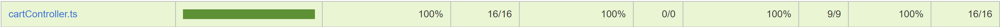
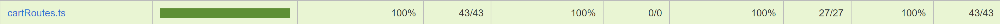

# Test Report

<The goal of this document is to explain how the application was tested, detailing how the test cases were defined and what they cover>

# Contents

- [Test Report](#test-report)
- [Contents](#contents)
- [Dependency graph](#dependency-graph)
    - [Flusso di dipendenze](#flusso-di-dipendenze)
        - [1. Authenticator](#1-authenticator)
        - [2. Routes:](#2-routes)
        - [3. Controller:](#3-controller)
        - [4. DAO:](#4-dao)
- [Integration approach](#integration-approach)
- [Tests](#tests)
- [Coverage](#coverage)
  - [Coverage of FR](#coverage-of-fr)
  - [Coverage white box](#coverage-white-box)
      - [Coverage about Review](#coverage-about-review)
        - [DAO](#dao)
        - [Controller](#controller)
        - [Routes](#routes)
      - [Coverage about Cart](#coverage-about-cart)
        - [DAO](#dao-1)
        - [Controller](#controller-1)
        - [Routes](#routes-1)
      - [Coverage about User](#coverage-about-user)
        - [DAO](#dao-2)
        - [Controller](#controller-2)
        - [Routes](#routes-2)
      - [Coverage about Product](#coverage-about-product)
        - [DAO](#dao-3)
        - [Controller](#controller-3)
        - [Routes](#routes-3)

# Dependency graph
  

### Flusso di dipendenze

##### 1. Authenticator
La classe Authenticator fornisce una serie di funzionalità per la gestione dell'autenticazione degli utenti all'interno di un'applicazione Express utilizzando Passport.js.

##### 2. Routes:

***Descrizione***: Questo componente si occupa della definizione delle routes HTTP per l'applicazione. Ogni route rappresenta un endpoint specifico che gli utenti possono utilizzare per interagire con il sistema.

***Funzione***: Quando una richiesta HTTP arriva al server, viene inoltrata al corretto gestore di route.

##### 3. Controller:

***Descrizione***: Questo componente funge da intermediario tra le routes e il DAO (Data Access Object). Il controller contiene la logica di business e gestisce le richieste provenienti dalle routes.

***Funzione***: Quando una richiesta viene inoltrata dal componente Routes, il Controller elabora la richiesta ed interagisce con il corrispettivo DAO per recuperare o manipolare i dati nel database.  

##### 4. DAO:

***Descrizione***: Questo componente si occupa dell'accesso diretto al database. Il DAO contiene metodi per eseguire operazioni CRUD (Create, Read, Update, Delete) sui dati delle recensioni.

***Funzione***: Il componente DAO esegue le query al database e restituisce i risultati allo specifico Controller, il quale li trasmette alla route chiamante.

# Integration approach
  L'approccio eseguito per effettuare gli unit tests è stato di tipo Bottom-Up:
  - ***Descrizione***: Questo approccio parte dalle componenti di livello più basso (come i moduli di accesso ai dati) e prosegue verso l'alto. Ogni componente viene integrata e testata prima di passare alla successiva

  - ***Vantaggi***: Garantisce che le fondamenta del sistema siano solide e ben testate prima di integrare le componenti superiori

  - ***Svantaggi***: Non consente di vedere i principali flussi di controllo dell'applicazione fino alle fasi avanzate dell'integrazione

  Successivamente è stato fatto integration testing con approccio top down andando a testare le routes senza alcun mock a livello più basso. 

La sequenza è stata la seguente:
1. **Test del DAO (Data Access Object)**:

    - Si inizia con i test del DAO, che rappresenta il livello più basso dell'applicazione, responsabile dell'accesso al database
    - Vengono eseguiti test unitari per ogni metodo del DAO per assicurarsi che le operazioni CRUD (Create, Read, Update, Delete) funzionino correttamente
    - Gli stub o i mock possono essere utilizzati per simulare il comportamento del database durante i test
2. **Test del Controller**:

    - Una volta che il DAO è stato testato e funziona correttamente, si passa ai test del controller
    - I test del controller verificano che il controller interagisca correttamente con il DAO, cioè che le richieste inviate al controller vengano gestite correttamente e che il controller restituisca le risposte attese
    - Anche in questo caso vengono eseguiti test unitari per verificare la logica presente all'interno del controller
3. **Test delle Route**:

    - Dopo aver verificato che il controller funzioni correttamente, si procede ai test delle route
    - I test delle route assicurano che le rotte definite nell'applicazione reagiscano correttamente alle richieste HTTP in arrivo e che inoltrino tali richieste al controller appropriato
    - Anche in questo caso vengono eseguiti test unitari per verificare che ogni rotta gestisca correttamente i vari tipi di richieste HTTP (GET, POST, PUT, DELETE)
4. **Definizione degli Integration Test**:

    - Dopo aver testato singolarmente le componenti di base, vengono definiti e eseguiti gli integration test

    - Gli integration test coprono scenari più ampi e testano l'interazione tra le diverse componenti del sistema
    
    - Durante gli integration test, vengono simulati flussi completi attraverso il sistema, dall'invio di una richiesta HTTP attraverso una rotta fino alla sua elaborazione da parte del controller e del DAO
# Tests

<in the table below list the test cases defined For each test report the object tested, the test level (API, integration, unit) and the technique used to define the test case (BB/ eq partitioning, BB/ boundary, WB/ statement coverage, etc)> <split the table if needed>

| Test case name | Object(s) tested | Test level | Technique used |
| :------------: | :--------------: | :--------: | :------------: |
|**Review DAO unit test**|||
|     Add Review - Resolve void           |     DAO             |   Unit Test         | WB - Eq partitioning               |
|     Add Review - Error DB           |     DAO             |   Unit Test         | WB - Boundary              |
|     Add Review - Error in db.get           |     DAO             |   Unit Test         | WB - Boundary              |
|     Add Review - Error in db.run           |     DAO             |   Unit Test         | WB - Boundary              |
|     Add Review - Error ExistingReviewError         |     DAO             |   Unit Test         | WB - Boundary              |
|     Add Review - Error ProductNotFoundError           |     DAO             |   Unit Test         | WB - Boundary              |
|   getProductReviews - Return reviews of product            |     DAO             |   Unit Test         | WB - Eq partitioning              |
|   getProductReviews - Error in db         |     DAO             |   Unit Test         | WB - Boundary              |
|   deleteReviews - Delete review and resolve           |     DAO             |   Unit Test         | WB - Eq partitioning              |
|   deleteReviews - Error in db.run           |     DAO             |   Unit Test         | WB - Boundary              |
|   deleteReviews - Error NoReviewProductError         |     DAO             |   Unit Test         | WB - Boundary              |
|   deleteReviewsOfProduct - Reviews are deleted successfully (resolve)          |     DAO             |   Unit Test         | WB - Eq partitioning        |
|   deleteReviewsOfProduct - Error NoReviewProductError         |     DAO             |   Unit Test         | WB - Boundary        |
|   deleteReviewsOfProduct - Error in db         |     DAO             |   Unit Test         | WB - Boundary        |
|   deleteAllReviews - Resolve         |     DAO             |   Unit Test         | WB - Eq partitioning        |
|   deleteAllReviews - Error in db         |     DAO             |   Unit Test         | WB - Boundary        |
|   deleteAllReviews - Nothing review         |     DAO             |   Unit Test         | WB - Boundary        |
|**Review Controller unit test**|||
|   addReview - Resolve         |     Controller           |   Unit Test         | WB - Eq partitioning        |
|   addReview - Error        |     Controller            |   Unit Test         | WB - Boundary     |
|   getProductReviews - Resolve with array of ProductReveiw[]         |     Controller             |   Unit Test         | WB - Eq partitioning        |
|   getProductReviews - Error         |     Controller             |   Unit Test         | WB - Boundary        |
|   deleteReview - Resolve       |     Controller            |   Unit Test         | WB - Eq partitioning        |
|   deleteReview - Error       |     Controller             |   Unit Test         | WB - Boundary        |
|   deleteReviewsOfProduct - Resolve       |     Controller             |   Unit Test         | WB - Eq partitioning        |
|   deleteReviewsOfProduct - Error       |     Controller             |   Unit Test         | WB - Boundary       |
|   deleteAllReviews - Resolve       |     Controller             |   Unit Test         | WB - Eq partitioning       |
|   deleteAllReviews - Error       |     Controller             |   Unit Test         | WB - Boundary       |
|**Review Route unit test**|||
|   POST ezelectronics/reviews/:model - 200       |     Route             |   Unit Test         | WB - Eq partitioning        |
|   POST ezelectronics/reviews/:model - 401       |     Route            |   Unit Test         | WB - Boundary     |
|   POST ezelectronics/reviews/:model - 401 user not logged      |     Route             |   Unit Test         | WB - Boundary     |
|   POST ezelectronics/reviews/:model - 401 the user is not customer      |     Route            |   Unit Test         | WB - Boundary     |
|   POST ezelectronics/reviews/:model - 422 score is not valid       |     Route             |   Unit Test         | WB - Boundary     |
|   POST ezelectronics/reviews/:model - 422 comment is empty       |     Route            |   Unit Test         | WB - Boundary     |
|   POST ezelectronics/reviews/:model - 422 model is empty     |     Route             |   Unit Test         | WB - Boundary     |
|   POST ezelectronics/reviews/:model - 503 fail of the contorller     |     Route             |   Unit Test         | WB - Boundary     |
|   GET ezelectronics/reviews/:model - 200     |     Route             |   Unit Test         | WB - Eq partitioning     |
|   GET ezelectronics/reviews/:model - 401 when user is not logged     |     Route             |   Unit Test         | WB - Boundary     |
|   GET ezelectronics/reviews/:model - 503 error of the controller     |     Route             |   Unit Test         | WB - Boundary     |
|   DELETE ezelectronics/reviews/:model - 200     |     Route             |   Unit Test         | WB - Eq partitioning    |
|   DELETE ezelectronics/reviews/:model - 401 when user is not logged     |     Route             |   Unit Test         | WB - Boundary    |
|   DELETE ezelectronics/reviews/:model - 401 when user is not customer     |     Route             |   Unit Test         | WB - Boundary    |
|   DELETE ezelectronics/reviews/:model - 503 error of the controller     |     Route             |   Unit Test         | WB - Boundary    |
|   DELETE ezelectronics/reviews/:model/all - 200     |     Route             |   Unit Test         | WB - Eq partitioning    |
|   DELETE ezelectronics/reviews/:model/all - 401 the user is not logged     |     Route             |   Unit Test         | WB - Boundary   |
|   DELETE ezelectronics/reviews/:model/all - 401 the user is a customer    |     Route             |   Unit Test         | WB - Boundary   |
|   DELETE ezelectronics/reviews/:model/all - 503 error of the controller     |     Route             |   Unit Test         | WB - Boundary   |
|   DELETE ezelectronics/reviews - 200     |     Route             |   Unit Test         | WB - Eq partitioning    |
|   DELETE ezelectronics/reviews - 401 user is not logged     |     Route             |   Unit Test         | WB - Boundary  |
|   DELETE ezelectronics/reviews - 401 user is a customer     |     Route             |   Unit Test         | WB - Boundary  |
|   DELETE ezelectronics/reviews - 503 error of the controller     |     Route             |   Unit Test         | WB - Boundary  |
|**Review Integration Test**|||
|   Integration of POST ezelectronics/reviews/:model - 200     |     Route+Controller+DAO             |   Integration Test         | BB - Eq Partitioning  |
|   Integration of POST ezelectronics/reviews/:model - 409 Already Exist Review     |     Route+Controller+DAO             |   Integration Test         | BB - Boundary  |
|   Integration of POST ezelectronics/reviews/:model - 422 Error of the score     |     Route+Controller+DAO             |   Integration Test         | BB - Boundary  |
|   Integration of POST ezelectronics/reviews/:model - 422 comment is empty     |     Route+Controller+DAO             |   Integration Test         | BB - Boundary  |
|   Integration of POST ezelectronics/reviews/:model - 404 error of a Unexisting product    |     Route+Controller+DAO             |   Integration Test         | BB - Boundary  |
|   Integration of GET ezelectronics/reviews/:model- 200     |     Route+Controller+DAO             |   Integration Test         | BB - Eq Partitioning  |
|   Integration of GET ezelectronics/reviews/:model- 200 without reviews    |     Route+Controller+DAO             |   Integration Test         | BB - Boundary  |
|   Integration of Integration of DELETE ezelectronics/reviews/:model - 200    |     Route+Controller+DAO             |   Integration Test         | BB - Eq Partitioning  |
|   Integration of Integration of DELETE ezelectronics/reviews/:model - 404 Product doesn't exist   |     Route+Controller+DAO             |   Integration Test         | BB - Boundary |
|   Integration of Integration of DELETE ezelectronics/reviews/:model - 404 review of a product that the user hasn't review   |     Route+Controller+DAO             |   Integration Test         | BB - Boundary |
|   Integration of Integration of Integration of DELETE ezelectronics/reviews/:model/all - 200   |     Route+Controller+DAO             |   Integration Test         | BB - Eq Partitioning |
|   Integration of Integration of Integration of DELETE ezelectronics/reviews/:model/all - 404 There aren't reviews for a specific product |     Route+Controller+DAO             |   Integration Test         | BB - Boundary |
|   Integration of POST ezelectronics/reviews/:model - 200     |     Route+Controller+DAO             |   Integration Test         | WB - Eq Partitioning  |
|   Integration of POST ezelectronics/reviews/:model - 409 Already Exist Review     |     Route+Controller+DAO             |   Integration Test         | WB - Boundary  |
|   Integration of POST ezelectronics/reviews/:model - 422 Error of the score     |     Route+Controller+DAO             |   Integration Test         | WB - Boundary  |
|   Integration of POST ezelectronics/reviews/:model - 422 comment is empty     |     Route+Controller+DAO             |   Integration Test         | WB - Boundary  |
|   Integration of POST ezelectronics/reviews/:model - 404 error of a Unexisting product    |     Route+Controller+DAO             |   Integration Test         | WB - Boundary  |
|   Integration of GET ezelectronics/reviews/:model- 200     |     Route+Controller+DAO             |   Integration Test         | WB - Eq Partitioning  |
|   Integration of GET ezelectronics/reviews/:model- 200 without reviews    |     Route+Controller+DAO             |   Integration Test         | WB - Boundary  |
|   Integration of Integration of DELETE ezelectronics/reviews/:model - 200    |     Route+Controller+DAO             |   Integration Test         | WB - Eq Partitioning  |
|   Integration of Integration of DELETE ezelectronics/reviews/:model - 404 Product doesn't exist   |     Route+Controller+DAO             |   Integration Test         | WB - Boundary |
|   Integration of Integration of DELETE ezelectronics/reviews/:model - 404 review of a product that the user hasn't review   |     Route+Controller+DAO             |   Integration Test         | WB - Boundary |
|   Integration of Integration of Integration of DELETE ezelectronics/reviews/:model/all - 200   |     Route+Controller+DAO             |   Integration Test         | WB - Eq Partitioning |
|   Integration of Integration of Integration of DELETE ezelectronics/reviews/:model/all - 404 There aren't reviews for a specific product |     Route+Controller+DAO             |   Integration Test         | WB - Boundary |
|**Cart DAO unit test**|||
|checkoutCart - resolve true | DAO | Unit Test | WB - Statement Coverage |
|checkoutCart - Errors: CartNotFound EmptyCart EmptyProductStock LowProductStock DBerror| DAO | Unit Test | WB - Statement Coverage |
|addToCart - resolve true | DAO | Unit Test | WB - Statement Coverage |
|addToCart - Errors: ProductNotFound EmptyProductStock DBerror | DAO | Unit Test | WB - Statement Coverage |
|removeProductFromCart - resolve true | DAO | Unit Test | WB - Statement Coverage|
|removeProductFromCart - Errors: ProductNotInCart CartNotFound EmptyCart ProductNotFound DBerror | DAO | Unit Test | WB - Statement Coverage |
|clearCart - resolve true | DAO | Unit Test | WB - Statement Coverage|
|clearCart - Errors: CartNotFound DBerror | DAO | Unit Test | WB - Statement Coverage|
|deleteAllCarts - resolve true | DAO | Unit Test | WB - Statement Coverage|
|deleteAllCarts - Errors: DBerror | DAO | Unit Test | WB - Statement Coverage|
|getAllCarts - resolve array of carts | DAO | Unit Test | WB - Statement Coverage|
|getAllCarts - Errors: DBerror | DAO | Unit Test | WB - Statement Coverage |
|getCustomerCarts - resolve array of paid carts | DAO | Unit Test | WB - Statement Coverage|
|getCustomerCarts - Errors: DBerror | DAO | Unit Test | WB - Statement Coverage |
|getCart - resolve unpaid cart | DAO | Unit Test | WB - Statement Coverage|
|getCart - Errors: DBerror | DAO | Unit Test | WB - Statement Coverage |
|**Cart Controller unit test**|||
|checkoutCart - resolve true | Controller  | Unit Test | WB - Statement Coverage - Path Coverage |
|checkoutCart - Errors: CartNotFound EmptyCart EmptyProductStock LowProductStock DBerror | Controller  | Unit Test  | WB - Statement Coverage - Path Coverage |
|addToCart - resolve true | Controller  | Unit Test | WB - Statement Coverage - Path Coverage |
|addToCart - Errors: ProductNotFound EmptyProductStock DBerror | Controller  | Unit Test | WB - Statement Coverage - Path Coverage |
|removeProductFromCart - resolve true | Controller  | Unit Test | WB - Statement Coverage - Path Coverage |
|removeProductFromCart - Errors: ProductNotInCart CartNotFound EmptyCart ProductNotFound DBerror | Controller  | Unit Test | WB - Statement Coverage - Path Coverage |
|clearCart - resolve true | Controller  | Unit Test | WB - Statement Coverage - Path Coverage |
|clearCart - Errors: CartNotFound DBerror | Controller  | Unit Test | WB - Statement Coverage - Path Coverage |
|deleteAllCarts - resolve true | Controller  | Unit Test | WB - Statement Coverage - Path Coverage |
|deleteAllCarts - Errors: DBerror | Controller  | Unit Test | WB - Statement Coverage - Path Coverage|
|getAllCarts - resolve array of carts | Controller  | Unit Test | WB - Statement Coverage - Path Coverage |
|getAllCarts - Errors: DBerror | Controller  | Unit Test | WB - Statement Coverage - Path Coverage  |
|getCustomerCarts - resolve array of paid carts | Controller  | Unit Test | WB - Statement Coverage - Path Coverage |
|getCustomerCarts - Errors: DBerror | Controller  | Unit Test | WB - Statement Coverage - Path Coverage |
|getCart - resolve unpaid cart | Controller  | Unit Test | WB - Statement Coverage - Path Coverage |
|getCart - Errors: DB error | Controller  | Unit Test | WB - Statement Coverage - Path Coverage |
|**Cart Route unit test**|||
|checkoutCart Patch /carts - 200 success code | Route  | Unit Test | WB  - Statement Coverage - Conditions Coverage |
|checkoutCart Patch /carts - Error codes : 404 400 401 409 503 | Route | Unit Test |WB  - Statement Coverage - Conditions Coverage |
|addToCart POST /carts - 200 success code | Route  | Unit Test |WB  - Statement Coverage - Conditions Coverage|
|addToCart POST /carts - Error codes: 401 404 409 422 503 | Route  | Unit Test |WB  - Statement Coverage - Conditions Coverage|
|removeProductFromCart DELETE /carts/products/:model - 200 success code | Route  | Unit Test | WB  - Statement Coverage - Conditions Coverage|
|removeProductFromCart DELETE /carts/products/:model - Error codes: 401 404 422 503 | Route  | Unit Test |WB  - Statement Coverage - Conditions Coverage|
|clearCart DELETE /carts/current - 200 success code | Route  | Unit Test |WB  - Statement Coverage - Conditions Coverage|
|clearCart DELETE /carts/current - Error codes: 401 404 503 | Route  | Unit Test | WB  - Statement Coverage - Conditions Coverage|
|deleteAllCarts DELETE /carts - 200 success code | Route  | Unit Test | WB  - Statement Coverage - Conditions Coverage|
|deleteAllCarts DELETE /carts - Error codes: 401 503 | Route  | Unit Test |WB  - Statement Coverage - Conditions Coverage|
|getAllCarts GET /carts/all - 200 success code | Route  | Unit Test | WB  - Statement Coverage - Conditions Coverage|
|getAllCarts GET /carts/all - Error codes: 401 503 | Route  | Unit Test | WB  - Statement Coverage - Conditions Coverage |
|getCustomerCarts GET /carts/history - 200 success code | Route  | Unit Test | WB  - Statement Coverage - Conditions Coverage|
|getCustomerCarts GET /carts/history - Error codes: 401 503 | Route | Unit Test | WB  - Statement Coverage - Conditions Coverage |
|getCart GET /carts - 200 success code | Route  | Unit Test | WB  - Statement Coverage - Conditions Coverage|
|getCart GET /carts - Error codes: 401 503 | Route | Unit Test | WB  - Statement Coverage - Conditions Coverage |
|**Cart integration test**|||
|checkoutCart Patch ezelectronics/carts - 200 success code | Route + Controller + DAO | Integration Test | BB - TD - EQ Partitioning - Boundary|
|checkoutCart Patch ezelectronics/carts - Error codes : 404 400 401 409 503 | Route + Controller + DAO |Integration Test | BB - TD - EQ Partitioning - Boundary|
|addToCart POST ezelectronics/carts - 200 success code | Route + Controller + DAO | Integration Test | BB - TD - EQ Partitioning - Boundary|
|addToCart POST ezelectronics/carts - Error codes: 401 404 409 422  | Route + Controller + DAO | Integration Test | BB - TD - EQ Partitioning - Boundary|
|removeProductFromCart DELETE ezelectronics/carts/products/:model - 200 success code | Route + Controller + DAO | Integration Test | BB - TD - EQ Partitioning - Boundary|
|removeProductFromCart DELETE ezelectronics/carts/products/:model - Error codes: 401 404 422  | Route + Controller + DAO | Integration Test | BB - TD - EQ Partitioning - Boundary|
|clearCart DELETE ezelectronics/carts/current - 200 success code | Route + Controller + DAO | Integration Test | BB - TD - EQ Partitioning - Boundary|
|clearCart DELETE ezelectronics/carts/current - Error codes: 401 404 | Route + Controller + DAO | Integration Test | BB - TD - EQ Partitioning - Boundary|
|deleteAllCarts DELETE ezelectronics/carts - 200 success code | Route + Controller + DAO | Integration Test | BB - TD - EQ Partitioning - Boundary|
|deleteAllCarts DELETE ezelectronics/carts - Error codes: 401 | Route + Controller + DAO | Integration Test | BB - TD - EQ Partitioning - Boundary|
|getAllCarts GET ezelectronics/carts/all - 200 success code | Route + Controller + DAO |Integration Test | BB - TD - EQ Partitioning - Boundary|
|getAllCarts GET ezelectronics/carts/all - Error codes: 401 | Route + Controller + DAO | Integration Test | BB - TD - EQ Partitioning - Boundary |
|getCustomerCarts GET ezelectronics/carts/history - 200 success code | Route + Controller + DAO | Integration Test | BB - TD - EQ Partitioning - Boundary|
|getCustomerCarts GET ezelectronics/carts/history - Error codes: 401 | Route + Controller + DAO | Integration Test | BB - TD - EQ Partitioning - Boundary |
|getCart GET ezelectronics/carts - 200 success code | Route + Controller + DAO | Integration Test | BB - TD - EQ Partitioning - Boundary|
|getCart GET ezelectronics/carts - Error codes: 401 | Route + Controller + DAO | Integration Test | BB - TD - EQ Partitioning - Boundary |
|**Product DAO unit test** ||||
|**ProductDAO registerProducts tests** ||||
| It should resolve true | DAO | Unit Test | WB - Statement coverage |
| It should reject with InvalidDateError when arrival date is after the current date | DAO | Unit Test | WB - Statement coverage |
| It should reject with ProductAlreadyExistsError when trying to insert an existing product | DAO | Unit Test | WB - Statement coverage |
| should reject with the correct error on db.run error | DAO | Unit Test | WB - Statement coverage |
| should reject with the correct error on try block error | DAO | Unit Test | WB - Statement coverage |
|**ProductDAO changeProductQuantity tests** ||||
| should reject with the correct error on db.get error | DAO | Unit Test | WB - Statement coverage |
| should reject with InvalidDateError when changeDate > currentDate | DAO | Unit Test | WB - Statement coverage |
| should reject with ProductNotFoundError when no product found | DAO | Unit Test | WB - Statement coverage |
| should reject with InvalidDateError when arrivalDate > changeDate | DAO | Unit Test | WB - Statement coverage |
| should reject with the correct error on db.run error | DAO | Unit Test | WB - Statement coverage |
| should resolve with the updated quantity on success | DAO | Unit Test | WB - Statement coverage |
| should reject with the correct error on try block error | DAO | Unit Test | WB - Statement coverage |
|**ProductDAO sellProduct tests** ||||
| should reject with the correct error on db.get error | DAO | Unit Test | WB - Statement coverage |
| should reject with ProductNotFoundError when no product found | DAO | Unit Test | WB - Statement coverage |
| should reject with InvalidDateError when arrivalDate > sellingDate | DAO | Unit Test | WB - Statement coverage |
| should reject with InvalidDateError when sellingDate > currentDate | DAO | Unit Test | WB - Statement coverage |
| should reject with EmptyProductStockError when currentQuantity is 0 | DAO | Unit Test | WB - Statement coverage |
| should reject with LowProductStockError when currentQuantity < selling quantity | DAO | Unit Test | WB - Statement coverage |
| should reject with the correct error on db.run error | DAO | Unit Test | WB - Statement coverage |
| should resolve with the updated quantity on success | DAO | Unit Test | WB - Statement coverage |
| should reject with the correct error on synchronous try block error | DAO | Unit Test | WB - Statement coverage |
|**ProductDAO getProduct tests** ||||
| should reject with the correct error on db.all error | DAO | Unit Test | WB - Statement coverage |
| should reject with ProductNotFoundError when no products found | DAO | Unit Test | WB - Statement coverage |
| should resolve with the correct products on success | DAO | Unit Test | WB - Statement coverage |
| getProduct with Wrong category - should throw InvalidCategoryError | DAO | Unit Test | WB - Statement coverage |
| should reject with the correct error on synchronous try block error | DAO | Unit Test | WB - Statement coverage |
| should query products by category when grouping is "category" | DAO | Unit Test | WB - Statement coverage |
| should query products by model when grouping is "model" | DAO | Unit Test | WB - Statement coverage |
|**ProductDAO getAvailableProducts tests** ||||
| should query available products by category when grouping is "category" | DAO | Unit Test | WB - Statement coverage |
| getAvailableProducts with Wrong category - should throw InvalidCategoryError | DAO | Unit Test | WB - Statement coverage |
| should query available products by model when grouping is "model" | DAO | Unit Test | WB - Statement coverage |
| getAvailableProducts with grouping 'model' and non-null category - should throw InvalidGroupingError | DAO | Unit Test | WB - Statement coverage |
| getAvailableProducts with invalid grouping - should throw InvalidGroupingError | DAO | Unit Test | WB - Statement coverage |
| should query all available products when grouping is null | DAO | Unit Test | WB - Statement coverage |
| getAvailableProducts with Wrong model - should throw ProductNotFoundError | DAO | Unit Test | WB - Statement coverage |
| should reject with the error when db.all generates an error | DAO | Unit Test | WB - Statement coverage |
| should reject with the error when a non-database error occurs | DAO | Unit Test | WB - Statement coverage |
|**ProductDAO deleteAllProducts tests** ||||
| should resolve to true when db.run does not generate an error | DAO | Unit Test | WB - Statement coverage |
| should reject with the error when db.run generates an error | DAO | Unit Test | WB - Statement coverage |
|**ProductDAO deleteProduct tests** ||||
| It should resolve true when product is deleted successfully | DAO | Unit Test | WB - Statement coverage |
| It should reject with an error when there is a database error | DAO | Unit Test | WB - Statement coverage |
| It should reject with ProductNotFoundError when no product is deleted | DAO | Unit Test | WB - Statement coverage |
| **Product Controller unit tests** | | | |
| **registerProducts** | | | |
| should register products correctly | Controller | Unit Test | WB - Statement Coverage |
| It should reject with an error | Controller | Unit Test | WB - Statement Coverage |
| **changeProductQuantity** | | | |
| It should resolve with the new quantity on success | Controller | Unit Test | WB - Statement Coverage |
| It should reject with an error on failure | Controller | Unit Test | WB - Statement Coverage |
| **sellProduct** | | | |
| It should resolve with the new quantity on success | Controller | Unit Test | WB - Statement Coverage |
| It should reject with an error on failure | Controller | Unit Test | WB - Statement Coverage |
| **getProducts** | | | |
| It should resolve with an array of products on success | Controller | Unit Test | WB - Statement Coverage |
| It should reject with an error on failure | Controller | Unit Test | WB - Statement Coverage |
| It should resolve with an array of products of the same category on success | Controller | Unit Test | WB - Statement Coverage |
| It should resolve with an array of products of the same model on success | Controller | Unit Test | WB - Statement Coverage |
| It should reject with an error on invalid category request | Controller | Unit Test | WB - Statement Coverage |
| **getAvailableProducts** | | | |
| It should resolve with an array of available products on success | Controller | Unit Test | WB - Statement Coverage |
| It should resolve with an array of available products of the same model on success | Controller | Unit Test | WB - Statement Coverage |
| It should resolve with an array of available products of the same category on success | Controller | Unit Test | WB - Statement Coverage |
| It should reject with an error on failure | Controller | Unit Test | WB - Statement Coverage |
| **deleteAllProducts** | | | |
| It should resolve with true when all products are successfully deleted | Controller | Unit Test | WB - Statement Coverage |
| It should reject with an error when the deletion fails | Controller | Unit Test | WB - Statement Coverage |
| **deleteProduct** | | | |
| It should resolve with true when the product is successfully deleted | Controller | Unit Test | WB - Statement Coverage |
| It should reject with an error when the deletion fails | Controller | Unit Test | WB - Statement Coverage |
| **Product Route unit tests** | | | |
| **POST /ezelectronics/products/** | | | |
| Should return 200 if model is valid -manager | Route | Unit Test | WB - Statement Coverage |
| Should return 200 if model is valid -admin | Route | Unit Test | WB - Statement Coverage |
| Should return 401 if user is not logged | Route | Unit Test | WB - Statement Coverage |
| It handles errors from registerProducts - 503 | Route | Unit Test | WB - Statement Coverage |
| **PATCH /:model** | | | |
| should return 200 and the new quantity if the model is valid | Route | Unit Test | WB - Statement Coverage |
| should return error if changeProductQuantity fails -503 | Route | Unit Test | WB - Statement Coverage |
| **PATCH /:model/sell** | | | |
| should return error if sellProduct fails - 503 | Route | Unit Test | WB - Statement Coverage |
| should return 200 and the new quantity if the model is valid | Route | Unit Test | WB - Statement Coverage |
| **GET /** | | | |
| should return all products if no query parameters are provided - 200 | Route | Unit Test | WB - Statement Coverage |
| should return all products of the same category if category query parameter is provided - 200 | Route | Unit Test | WB - Statement Coverage |
| should return all products of the same model if model query parameter is provided - 200 | Route | Unit Test | WB - Statement Coverage |
| should return error if grouping is "category" but no category is provided | Route | Unit Test | WB - Statement Coverage |
| should return error if grouping is "model" but no model is provided - 422 | Route | Unit Test | WB - Statement Coverage |
| should return error if grouping is not "model" or "category" - 422 | Route | Unit Test | WB - Statement Coverage |
| **GET /available** | | | |
| should return all available products if no query parameters are provided - 200 | Route | Unit Test | WB - Statement Coverage |
| should return all available products of the same category if category query parameter is provided - 200 | Route | Unit Test | WB - Statement Coverage |
| should return error if invalid category is provided | Route | Unit Test | WB - Statement Coverage |
| should return all products of the same model if model query parameter is provided - 200 | Route | Unit Test | WB - Statement Coverage |
| should handle errors thrown by getAvailableProducts - 503 | Route | Unit Test | WB - Statement Coverage |
| **DELETE /** | | | |
| should delete all products if user is logged in and is an admin or manager - 200 | Route | Unit Test | WB - Statement Coverage |
| should handle errors thrown by deleteAllProducts - 503 | Route | Unit Test | WB - Statement Coverage |
| **DELETE /:model** | | | |
| should delete a product if user is logged in and is an admin or manager - 200 | Route| Unit Test | WB - Statement Coverage |
| should handle errors thrown by deleteProduct - 503 | Route | Unit Test | WB - Statement Coverage |
|**Product integration tests** ||||
|**registerProduct integration tests** ||||
| register product - 200 success code | Route+Controller+DAO | Integration Test | BB - EQ Partitioning |
| register product - 401 error code not Authorized | Route+Controller+DAO | Integration Test | BB - EQ Partitioning |
| register product - 401 error code not logged in | Route+Controller+DAO | Integration Test | BB - EQ Partitioning |
| register product - already existing product (409) | Route+Controller+DAO | Integration Test | BB - EQ Partitioning |
| register product - Category null | Route+Controller+DAO | Integration Test | BB  - Boundary |
| register product - wrong Category | Route+Controller+DAO | Integration Test | BB - EQ Partitioning |
| register product - Selling price null | Route+Controller+DAO | Integration Test | BB - Boundary|
| register product - arrival date after current date (400) | Route+Controller+DAO | Integration Test | BB - EQ Partitioning |
| register product - selling price 0 | Route+Controller+DAO | Integration Test | BB - Boundary |
| register product - selling price < 0 | Route+Controller+DAO | Integration Test | BB - EQ Partitioning |
| register - selling price string | Route+Controller+DAO | Integration Test | BB - EQ Partitioning |
|**deleteProduct integration tests** ||||
| delete product - OK | Route+Controller+DAO | Integration Test | BB - EQ Partitioning |
| delete product - product not found | Route+Controller+DAO | Integration Test | BB - EQ Partitioning |
| delete product - error 401 Not Authorized | Route+Controller+DAO | Integration Test | BB - EQ Partitioning |
| delete product - error 401 Not Logged IN | Route+Controller+DAO | Integration Test | BB - EQ Partitioning |
|**changeProductQuantity integration tests** ||||
| changeProductquantity - 200 success code | Route+Controller+DAO | Integration Test | BB - EQ Partitioning |
| changeProductquantity - 200 success code new quantity = 0 | Route+Controller+DAO | Integration Test | BB - Boundary|
| changeProductquantity - 200 success code new quantity < 0 | Route+Controller+DAO | Integration Test | BB - EQ Partitioning |
| changeProductquantity - 400 error code changeDate > currentDate | Route+Controller+DAO | Integration Test | BB - EQ Partitioning |
| changeProductquantity - 400 error code changeDate < currentDate by 1 day | Route+Controller+DAO | Integration Test | BB - EQ Partitioning |
| changeProductquantity - 400 error code changeDate << arrivalDate | Route+Controller+DAO | Integration Test | BB - EQ Partitioning |
| changeProductquantity - 404 error code product not found | Route+Controller+DAO | Integration Test | BB - EQ Partitioning |
|**sellProduct integration tests** ||||
| sellProduct - 200 success code | Route+Controller+DAO | Integration Test | BB - EQ Partitioning |
| sellProduct - 200 success code quantity = 1 | Route+Controller+DAO | Integration Test | BB - Boundary |
| sellProduct - 401 error code not Authorized | Route+Controller+DAO | Integration Test | BB - EQ Partitioning |
| sellProduct - 422 error code quantity 0 | Route+Controller+DAO | Integration Test | BB - Boundary |
| sellProduct - 422 error code quantity <0 | Route+Controller+DAO | Integration Test | BB - EQ Partitioning |
| sellProduct - 422 error code model empty | Route+Controller+DAO | Integration Test | BB - EQ Partitioning |
| sellProduct - 400 error code sellingDate>currentDate | Route+Controller+DAO | Integration Test | BB - EQ Partitioning |
| sellProduct - 400 error code sellingDate < arrivalDate | Route+Controller+DAO | Integration Test | BB - EQ Partitioning |
| sellProduct - 404 error code ProductNotFound | Route+Controller+DAO | Integration Test | BB - EQ Partitioning |
| sellProduct - 409 error code EmptyProductStock | Route+Controller+DAO | Integration Test | BB - Boundary  |
| sellProduct - 409 error code LowProductStock | Route+Controller+DAO | Integration Test | BB - EQ Partitioning |
|**getProducts integration tests**
| getProducts All product - 200 success code | Route+Controller+DAO | Integration Test | BB - EQ Partitioning |
| getProducts product by Category - 200 success code | Route+Controller+DAO | Integration Test | BB - EQ Partitioning |
| getProducts product by Model - 200 success code | Route+Controller+DAO | Integration Test | BB - EQ Partitioning |
| getProducts- 422 error code | Route+Controller+DAO | Integration Test | BB - EQ Partitioning |
| getProducts - 401 success code not Authorized | Route+Controller+DAO | Integration Test | BB - EQ Partitioning |
| getProducts product by Model - 404 error code product not found | Route+Controller+DAO | Integration Test | BB - EQ Partitioning |
| getProducts - 422 error code grouping: null and model:not null | Route+Controller+DAO | Integration Test | BB - Boundary  |
| getProducts All - 422 error code grouping: category and model: not null,: and category null | Route+Controller+DAO | Integration Test | BB - Boundary |
| getProducts All - 422 error code grouping: model and category : not null and model: null | Route+Controller+DAO | Integration Test | BB - boundary|
| getProducts All - 422 error code grouping: model and category: not null and model:not null | Route+Controller+DAO | Integration Test | BB - Boundary |
|**getAvailableProducts** ||||
| getAvailableproducts ALL - 200 success code | Route+Controller+DAO | Integration Test | BB - EQ Partitioning |
| getAvailableproducts - 422 error code wrong category | Route+Controller+DAO | Integration Test | BB - EQ Partitioning |
| getAvailableproducts by Category - 200 success code | Route+Controller+DAO | Integration Test | BB - EQ Partitioning |
| getAvailableProducts - 422 error code grouping null and model or category not null | Route+Controller+DAO | Integration Test | BB - Boundary |
| getAvailableProducts - 422 error code grouping category and model not null and category null | Route+Controller+DAO | Integration Test | BB - Boundary|
| getAvailableProducts - 401 error code not logged in | Route+Controller+DAO | Integration Test | BB - EQ Partitioning |
|**deleteALL** ||||
| deleteAll 200 success code | Route+Controller+DAO | Integration Test | BB - EQ Partitioning |
| deleteAll - 401 error code not Authorized | Route+Controller+DAO | Integration Test | BB - EQ Partitioning |
| deleteAll - 401 error code not logged in | Route+Controller+DAO | Integration Test | BB - EQ Partitioning |
| |**User DAO unit test**|
**getIsUserAuthenticatedTest**|
should resolve true when credential are correct| DAO | Unit Test | WB - Statement Coverage |
should resolve false when credential are incorrect | DAO | Unit Test| WB - Statement Coverage|
should resolve false when user not found | DAO | Unit Test| WB - Statement Coverage|
|should resolve false when user has no salt|DAO|Unit Test| WB - Statement Coverage|
should reject with error on db.get error| DAO | Unit Test | WB - Statement Coverage |
should reject with error on crypto error | DAO | Unit Test | WB - Statement Coverage|
**createUser Test**|
It should resolve true| DAO | Unit Test| WB - Statement Coverage|
should reject with UserAlreadyExistsError when username is already taken | DAO | Unit test | WB - Statement Coverage|
should reject with error on db.run error | DAO | Unit Test | WB - Statement Coverage|
should reject with error on crypto error| DAO | Unit test | WB - Statement Coverage|
**getAllUsers Test**|
It should resolve with an array of users|DAO|Unit Test| WB - Statement Coverage|
should reject with error on db.all error|DAO|Unit Test| WB - Statement Coverage|
**getUserByUsername Test**|
It should resolve with a User object when user is found|DAO|Unit Test|WB - Statement Coverage|
It should reject with UserNotFoundError when no user is found|DAO|Unit Test| WB - Statement Coverage|
It should reject with an error when there is a database error|DAO|Unit Test| WB - Statement Coverage|
**getUserByRole Test**|
It should resolve with an array of users for a valid role|DAO|Unit Test|WB - EQ Partitioning|
It should reject with an error when there is a database error|DAO|Unit Test|WB - Statement Coverage|
**deleteUser Test**|
It should resolve with true for authorized user|DAO|Unit Test|WB - EQ Partitioning|
It should reject with UnauthorizedUserError if user is not authorized|DAO|Unit Test|WB - Statement Coverage|
It should reject with UserNotFoundError if user to delete does not exist|DAO|Unit Test|WB - Statement Coverage|
It should reject with UserIsAdminError if admin tries to delete another admin|DAO|Unit Test|WB - Statement Coverage|
It should reject with an error when there is a database error|DAO|Unit Test|WB - Statement Coverage|
It should reject with error on db.get error|DAO|Unit Test|WB - Statement Coverage|
It should reject with error on db.run error|DAO|Unit Test|WB - Statement Coverage|
**deleteAll Test**|
It should resolve with true after deleting all non-admin users and logged user is admin|DAO|Unit Test|WB - Statement Coverage|
It should reject with an error when there is a database error|DAO|Unit Test|WB - Statement Coverage|
**updateUserInfo Test**|
It should resolve with updated user info for authorized user|DAO|Unit Test|WB - EQ Partitioning|
It should reject with UnauthorizedUserError if user is not authorized|DAO|Unit Test|WB - Statement Coverage|
It should reject with UserNotFoundError if user to update does not exist|DAO|Unit Test|WB - Statement Coverage|
It should reject with UnauthorizedUserError if admin tries to update another admin|DAO|Unit Test|WB - Statement Coverage|
It should reject with InvalidBirhdateError if birthdate is invalid|DAO|Unit Test|WB - Statement Coverage|
It should reject with an error when there is a database error|DAO|Unit Test|WB - Statement Coverage|
should reject with error on db.get error|DAO|Unit Test|WB - Statement Coverage|
should reject with error on db.run error|DAO|Unit Test|WB - Statement Coverage|
| |**User CONTROLLER unit test**|
**createUser Test**|
It should return false if user creation was unsuccessful|Controller|Unit Test|WB - EQ Partitioning|
It should return true if user creation was successful|Controller|Unit Test|WB - EQ Partitioning|
It should throw UserAlreadyExistsError if the username is already taken|Controller|Unit Test|WB - EQ Partitioning|
It should handle general errors|Controller|Unit Test|WB - Statement Coverage|
**getUsers Test**|
It should return an empty array|Controller|Unit Test|WB - Statement Coverage|
It should return an array of users|Controller|Unit Test|WB - Statement Coverage|
**getUsersByRole Test**|
It should return users by role|Controller|Unit Test|WB - Statement Coverage|
It should handle general errors"|Controller|Unit Test|WB - Statement Coverage|
**getUserByUsername Test**|
It should return the user by username|Controller|Unit Test|WB - Statement Coverage|
It should throw UserNotFoundError if the user does not exist|Controller|Unit Test|WB - Statement Coverage|
It should handle general errors|Controller|Unit Test|WB - Statement Coverage|
**deleteUser Test**|
Admin can delete any non-Admin user|Controller|Unit Test|WB - EQ Partitioning|
User can delete their own account|Controller|Unit Test|WB - EQ Partitioning|
Not-admin user cannot delete another user|Controller|Unit Test|WB - Statement Coverage|
Admin cannot delete another Admin user|Controller|Unit Test|WB - Statement Coverage|
It should throw UserNotFoundError if user does not exist|Controller|Unit Test|WB - Statement Coverage|
It should handle general database errors|Controller|Unit Test|WB - Statement Coverage|
**deleteAllUsers Test**|
It should return true when all non-Admin users are deleted|Controller|Unit Test|WB - EQ Partitioning|
It should handle errors and reject the promise|Controller|Unit Test|WB - Statement Coverage|
**updateUserInfo Test**|
It should return the updated user info when the update is successful|Controller|Unit Test|WB - Statement Coverage|
It should return the updated user info when the update is successful|Controller|Unit Test|WB - Statement Coverage|
It should throw InvalidBirthdateError if the birthdate is invalid|Controller|Unit Test|WB - Statement Coverage|
It should throw UnauthorizedUserError if the user is not authorized to update|Controller|Unit Test|WB - Statement Coverage|
It should throw UserNotFoundError if the user to update does not exist|Controller|Unit Test|WB - Statement Coverage|
|| **User ROUTE Unit Test**|
**POST /users Test**|
It should return a 200 success code|Route|Unit Test|WB - Statement Coverage|
It should return a 409 error code when username is already in use|Route|Unit Test|WB - Statement Coverage|
It should return a 422 error code when required fields are missing|Route|Unit Test|WB - EQ Partitioning|
**GET /users Test**|
It should return 200 success code|Route|Unit Test|WB - EQ Partitioning|
It should return 401 if user is not admin|Route|Unit Test|WB - EQ Partitioning|
It should return 401 if user is not logged in|Route|Unit Test|WB - EQ Partitioning|
**GET /users/roles/:role Test**|
It should return 200 success code|Route|Unit Test|WB - EQ Partitioning|
It should return 422 if role is invalid|Route|Unit Test|WB - EQ Partitioning|
It should return 401 if logged user is not admin|Route|Unit Test|WB - EQ Partitioning|
**GET /users/:username Test**|
It returns 200 if an admin requests the data of a customer|Route|Unit Test|WB - Statement Coverage|
It returns 200 if a customer requests their own data|Route|Unit Test|WB - Statement Coverage|
It returns 401 if a customer requests the data of another user|Route|Unit Test|WB - Statement Coverage|
It returns 404 if the user does not exist|Route|Unit Test|WB - Statement Coverage|
It returns 422 if the username is empty|Route|Unit Test|WB - Statement Coverage|
**DELETE /users/:username Test**|
It returns 200 if the delete operation is successful|Route|Unit Test|WB - Statement Coverage|
It returns 401 if admin tries to delete an other admin|Route|Unit Test|WB - Statement Coverage|
It returns 401 if customer tries to delete an other user|Route|Unit Test|WB - Statement Coverage|
It returns 200 if customer tries to delete his account|Route|Unit Test|WB - Statement Coverage|
It returns 200 if admin tries to delete his account|Route|Unit Test|WB - Statement Coverage|
It return 404 if admin tries to delete notExist user| Route| Unit Test| WB - EQ Partitioning |
**DELETE /users Test**|
It returns 200 if the delete operation is successful|Route|Unit Test|WB - EQ Partitioning|
It returns 401 if the user is not admin|Route|Unit Test|WB - EQ Partitioning|
**PATCH /users/:username Test**|
It returns 200 if admin tries to update the details of customer user|Route|Unit Test|WB - Statement Coverage|
It returns 200 if customer user tries to update his account's details|Route|Unit Test|WB - Statement Coverage|
|It returns 401 if customer tries to update details of others customers|Route|Unit Test|WB - Statement Coverage|
It returns 401 if admin user tries to update details of others admin users|Route|Unit Test|WB - Statement Coverage|
It returns 422 for hanlder Error|Route|Unit Test|WB - EQ Partitioning|
It returns 400 if date is invalid|Route|Unit Test|WB - EQ Partitioning|
||**Auth ROUTE Test**|
**POST /session Test**|
It should returns 200 if user logged in with correct password|Route|Unit Test|WB - Statement Coverage|
It should returns 422 if username is empty|Route|Unit Test|WB - Statement Coverage|
It should returns 422 if password is empty|Route|Unit Test|WB - Statement Coverage|
**DELETE /sessions/curren Test**|
It should returns 401 if the user is not authenticated|Route|Unit Test|WB - EQ Partitioning|
It should returns 200 if user is authenticated|Route|Unit Test|WB - EQ Partitioning|
**GET /sessions/currentTest**|
It should return 401 if user is not logged in|Route|Unit Test|WB - Statement Coverage|
It should returns 200 if user is logged in|Route|Unit Test|WB - Statement Coverage|
||**User Integration Test**|
**createUser Test**|
It should returns 200 if user is created successfully|Route+Controller+DAO| Integration Test| BB TD - EQ Partitioning |
It should returns 409 if username already exist|Route+Controller+DAO| Integration Test| BB TD - EQ Partitioning |
It should returns 422 if username is missing|Route+Controller+DAO| Integration Test| BB TD - EQ Partitioning |
It should returns 422 if name is missing|Route+Controller+DAO| Integration Test| BB TD - EQ Partitioning|
It should returns 422 if surname is missing|Route+Controller+DAO| Integration Test| BB TD - EQ Partitioning |
It should returns 422 if password is missing|Route+Controller+DAO| Integration Test| BB TD - EQ Partitioning |
It should returns 422 if role is missing|Route+Controller+DAO| Integration Test| BB TD - EQ Partitioning |
It should returns 422 if role is invalid|Route+Controller+DAO| Integration Test| BB TD - EQ Partitioning |
It should returns 422 if username is empty|Route+Controller+DAO| Integration Test| BB TD - EQ Partitioning |
It should returns 422 if name is empty|Route+Controller+DAO| Integration Test| BB TD - EQ Partitioning |
It should returns 422 if surname is empty|Route+Controller+DAO| Integration Test| BB TD - EQ Partitioning |
It should returns 422 if password is empty|Route+Controller+DAO| Integration Test| BB TD - EQ Partitioning |
It should returns 422 if username and password are missing|Route+Controller+DAO| Integration Test| BB TD - EQ Partitioning |
It should returns 422 if name and surname are missing|Route+Controller+DAO| Integration Test| BB TD - EQ Partitioning |
It should returns 422 if role is missing|Route+Controller+DAO| Integration Test| BB TD - EQ Partitioning |
**getUserByUsername Test**|
It should returns 401 if user is not logged in|Route+Controller+DAO| Integration Test|BB TD - EQ Partitioning |
It should returns 200 if customer login and get himself|Route+Controller+DAO| Integration Test| BB TD - EQ Partitioning|
It should returns 200 if admin login and get himself|Route+Controller+DAO| Integration Test| BB TD - EQ Partitioning |
It should returns 200 if manager login and get himself|Route+Controller+DAO| Integration Test| BB TD - EQ Partitioning |
It should returns 200 if admin login and get other customer users|Route+Controller+DAO| Integration Test| BB TD - EQ Partitioning |
It should returns 200 if admin login and get other manager users|Route+Controller+DAO| Integration Test| BB TD - EQ Partitioning |
It should returns 200 if admin login and get other admin users|Route+Controller+DAO| Integration Test| BB TD - EQ Partitioning |
It should returns 401 if customer login and get other customer users|Route+Controller+DAO| Integration Test| BB TD - EQ Partitioning |
It should returns 401 if manager login and get other customer users|Route+Controller+DAO| Integration Test| BB TD - EQ Partitioning |
It should returns 404 if admin login but user does not exist in db|Route+Controller+DAO| Integration Test| BB TD - EQ Partitioning |
It should returns 401 if customer login and get user that does not exist|Route+Controller+DAO| Integration Test| BB TD - EQ Partitioning |
**getAllUsers Test**|
It should returns 401 if user is not logged|Route+Controller+DAO| Integration Test| BB TD - EQ Partitioning |
It should returns 200 if user is admin|Route+Controller+DAO| Integration Test| BB TD - EQ Partitioning |
It should returns 401 if user is customer|Route+Controller+DAO| Integration Test| BB TD - EQ Partitioning |
It should returns 401 if user is manager|Route+Controller+DAO| Integration Test| BB TD - EQ Partitioning |
 **getUserByRole Test**|
It should returns 401 if user is not logged in|Route+Controller+DAO| Integration Test| BB TD - EQ Partitioning|
It should returns 200 if user is admin|Route+Controller+DAO| Integration Test| BB TD - EQ Partitioning|
It should returns 401 if user is customer|Route+Controller+DAO| Integration Test| BB TD - EQ Partitioning |
It should returns 401 if user is manager|Route+Controller+DAO| Integration Test| BB TD - EQ Partitioning |
It should returns 422 if role is invalid|Route+Controller+DAO| Integration Test| BB TD - EQ Partitioning |
 **deleteUser Test**|
 It should returns 401 if user is not logged in|Route+Controller+DAO| Integration Test| BB TD - EQ Partitioning |
 It should returns 200 if customer delete himself|Route+Controller+DAO| Integration Test| BB TD - EQ Partitioning |
 It should returns 200 if admin delete himself|Route+Controller+DAO| Integration Test| BB TD - EQ Partitioning|
 It should returns 200 if manager delete himself|Route+Controller+DAO| Integration Test| BB TD - EQ Partitioning |
 It should returns 200 if admin delete other not-admin users|Route+Controller+DAO| Integration Test| BB TD - EQ Partitioning |
 It should returns 401 if admin tries to delete other admin user|Route+Controller+DAO| Integration Test| BB TD - EQ Partitioning |
 It should returns 401 if customer tries to delete other customer users|Route+Controller+DAO| Integration Test| BB TD - EQ Partitioning |
 It should returns 401 if manager tries to delete other customer users|Route+Controller+DAO| Integration Test| BB TD - EQ Partitioning |
 It should returns 404 if admin tries to delete user that does not exist|Route+Controller+DAO| Integration Test| BB TD - EQ Partitioning |
 **deleteAllUsers Test**|
It should returns 401 if user is not logged in|Route+Controller+DAO| Integration Test| BB TD - EQ Partitioning |
It should returns 401 if user is customer|Route+Controller+DAO| Integration Test| BB TD - EQ Partitioning |
It should returns 401 if user is manager|Route+Controller+DAO| Integration Test| BB TD - EQ Partitioning |
It should returns 200 if user is admin|Route+Controller+DAO| Integration Test| BB TD - EQ Partitioning |
**updateUserInfo Test**|
It should returns 401 if user is not logged in|Route+Controller+DAO| Integration Test| BB TD - EQ Partitioning|
It should returns 200 if customer update his details|Route+Controller+DAO| Integration Test| BB TD - EQ Partitioning |
It should return 200 if admin update his details|Route+Controller+DAO| Integration Test| BB TD - EQ Partitioning|
It should returns 200 if manager update his details|Route+Controller+DAO| Integration Test| BB TD - EQ Partitioning |
It should returns 422 if name is empty|Route+Controller+DAO| Integration Test| BB TD - EQ Partitioning |
It should returns 422 if surname is empty|Route+Controller+DAO| Integration Test| BB TD - EQ Partitioning |
It should returns 422 if address is empty|Route+Controller+DAO| Integration Test| BB TD - EQ Partitioning |
It should returns 422 if birthdate is empty|Route+Controller+DAO| Integration Test| BB TD - EQ Partitioning |
It should returns 400 if birthdate is Invalid|Route+Controller+DAO| Integration Test| BB TD - Boundary |
It should returns 422 if date format is not valid|Route+Controller+DAO| Integration Test| BB TD - EQ Partitioning |
It should returns 401 if admin tries to update other admin's details|Route+Controller+DAO| Integration Test| BB TD - EQ Partitioning |
It should returns 200 if admin tries to update other not-admin's details|Route+Controller+DAO| Integration Test| BB TD - EQ Partitioning |
It should returns 401 if customer tries to update other admin's details|Route+Controller+DAO| Integration Test| BB TD - EQ Partitioning |
It should returns 401 if customer tries to update other manager's details|Route+Controller+DAO| Integration Test| BB TD - EQ Partitioning |
It should returns 404 if admin tries to update a not admin user that doesn't exist|Route+Controller+DAO| Integration Test| BB TD - EQ Partitioning |
||**Auth Integration Test**|
**login Test**|
It should returns 422 if username is empty|Route+Controller+DAO| Integration Test| BB TD - EQ Partitioning |
It should return 422 if password is empty|Route+Controller+DAO| Integration Test| BB TD - EQ Partitioning |
It should returns 401 if user doesn't exist|Route+Controller+DAO| Integration Test| BB TD - EQ Partitioning |
It should returns 401 if password is wrong|Route+Controller+DAO| Integration Test| BB TD - EQ Partitioning |
It should return 200 if password is correct|Route+Controller+DAO| Integration Test| BB TD - EQ Partitioning |
It should return 401 if username already logged in|Route+Controller+DAO| Integration Test| BB TD - EQ Partitioning |
**logout Test**|
It should returns 200 if logout is successful|Route+Controller+DAO| Integration Test| BB TD - EQ Partitioning |
It should returns 401 if user tries to logout without a session|Route+Controller+DAO| Integration Test| BB TD - EQ Partitioning |
It should returns 401 if user tries to logout with a wrong session|Route+Controller+DAO| Integration Test| BB TD - EQ Partitioning |
**retrieveUserInfo Test**|
It should returns 401 if session is wrong|Route+Controller+DAO| Integration Test| BB TD - EQ Partitioning |
It should returns 200 if user get current user info|Route+Controller+DAO| Integration Test| BB TD - EQ Partitioning |

# Coverage

## Coverage of FR

Report in the following table the coverage of functional requirements and scenarios (from official requirements).

| Functional Requirement or scenario | Test(s) |
| :--------------------------------: | :-----: |
Scenario 1.1 Successful login| Integration: It should return 200 if password is correct.   Route: POST /session - It should returns 200 if user logged in with correct password |
Scenario 1.2 Wrong password| Integration: It should returns 401 if password is wrong| 
Scenario 1.3 User not registered | Integration: It should return 401 if user doesn't exist|
Scenario 2.1 Logout | Integration: It should return 200 if logout is successful   Route: DELETE /sessions/current - It should returns 200 if user is logged in|
Scenario 2.2 User already logged out|Integration: It should returns 401 if user tries to logout without a session |
Scenario 3.1 Registration| Integration: It should returns 200 if user is created successfully   Route: POST /users - It should return a 200 success code   Controller: It should return true if user creation was successful   Dao: It should resolve true   |
Scenario 3.2 Username already in use |Integration:should return 409 if username already exists   Route: POST /users - It should return a 409 error code when username is already in use   Controller: It should throw UserAlreadyExistsError if the username is already taken   Dao: should reject with UserAlreadyExistsError when username is already taken  |
Scenario 3.3 User provides empty parameters|Integration:  It should return 422 if username is empty   It should return 422 if name is empty   It should return 422 if surname is empty   It should return 422 if password is empty   It should return 422 if role is empty   It should return 422 if password is empty Route: POST /users - It should return a 422 error code when required fields are missing   |
Scenario 4.1 View the information of one user| Integration:   It should returns 200 if customer login and get himself   It should returns 200 if admin login and get himself  It should returns 200 if manager login and get himself   It should returns 200 if admin login and get other customer users   It should returns 200 if admin login and get other manager users   It should returns 200 if admin login and get other admin users   It should returns 401 if customer login and get other customer users   It should returns 401 if manager login and get other customer users    Route: GET /users/:username   It returns 200 if an admin requests the data of a customer   It returns 200 if a customer requests their own data   It returns 401 if a customer requests the data of another user   Controller: It should return the user by username   Dao: It should resolve with a User object when user is found    |
Scenario 4.2 Ask to view information of a user who does not exist | Integration: It should return 404 if admin login but user does not exist in db  Route: GET /users/:username - It returns 404 if the user does not exist   Controller: It should throw UserNotFoundError if the user does not exist   Dao: It should reject with UserNotFoundError when no user is found  |
Scenario 4.3 View the information of all users |Integration:  It should returns 200 if user is admin   It should returns 401 if user is customer  It should returns 401 if user is manager   Route: GET /users   It should return 200 succes code    It should return 401 if user is not admin   Controller:  It should return an empty array   It should return an array of users   Dao: It should resolve with an array of users |
Scenario 4.4 View the information of all users with a specific role (Customer or Manager)|Integration:  It should returns 200 if user is admin  It should returns 401 if user is customer   It should returns 401 if user is manager   Route: GET /users/roles/:role   It should return 200 success code   It should return 401 if logged user is not admin  Controller: It should return users by role   Dao: It should resolve with an array of users with a valid role |
Scenario 4.5 Ask to view information of users with a role that does not exist |Integration: It should returns 422 if role is invalid   Route: GET /users/roles/:role - It should return 422 if role is invalid   |
Scenario 5.1 Delete one user |Integration:  It should returns 200 if customer delete himself   It should returns 200 if admin delete himself  It should returns 200 if manager delete himself   It should returns 200 if admin delete other not-admin users  It should returns 401 if admin tries to delete other admin user  It should returns 401 if customer tries to delete other customer users  It should returns 401 if manager tries to delete other customer users   Route: DELETE /users/:username   It returns 200 if the delete operation is successful   It returns 401 if admin tries to delete an other admin   It return 401 if customer tries to delete other users   It returns 200 if customer tries to delete his account  It returns 200 if admin try to delete his account   Controller:  Admin can delete any non-Admin user  User can delete their own account    Non-admin user cannot delete another users   Admin cannot delete another Admin user  Dao: It should resolve with true for authorized user|
Scenario 5.2 Try to delete a user that does not exist|Integration: It should returns 404 if admin tries to delete user that does not exist   Route: It returns 404 if admin tries to delete notExist user  Controller: It Should throw UserNotFoundError if user does not exist  Dao: It should reject with UserNotFoundError if user to delete does not exist|
Scenario 12.1 Edit user information|Integration  It should returns 200 if customer update his details   It should return 200 if admin update his details   It should returns 200 if manager update his details  Route: PATCH /users/:username - It returns 200 if customer user tries to update his account's details  Controller: It should return the updated user info when the update is successful   Dao: It should resolve with updated user info for authorized user  | 
Scenario 13.1 Delete all non-admin user |Integration: It should returns 200 if user is admin  Route: DELETE /users - It returns 200 if the delete operation is successful   Controller: It should return true when all non-Admin users are deleted   Dao: It should resolve with true after deleting all non-admin users |
|Scenario 6.1   Register a new product |Integration: register product - 200 success code,  Controller: registerProducts - should register products correctly ,   Route: POST /ezelectronics/products/ - Should return 200 if model is valid -manager,   Dao: ProductDAO registerProducts tests - it should resolve true |
|Scenario 6.2   Try to register a product that already exists |Integration: register product - already existing product (409), register product - Selling price null ,register product - arrival date after current date (400), register - selling price string   Controller: It should reject with an error,   Route: POST /ezelectronics/products/ - It handles errors from registerproducts ,   Dao:It should reject with ProductAlreasyExistsError when trying to instert an existing product   |
|Scenario 6.3   Try to register a product with invalid input parameters |Integration:register product - Category null,   Controller: It should reject with an error,  Route: POST /ezelectronics/products - It handles errors from registerProduct,   Dao: It should reject InvalidDateError when arrivalDate is after the current date  |
|Scenario 6.4   Update the quantity of a product|Integration:changeProductquantity - 200 success code,  Controller:It should resolve with the new quantity on success,   Route: PATCH /:model - should return 200 and the new quantity if the model is valid   Dao:  Should resolve with the updated quantity on success|
|Scenario 6.5   Try to encrease the quantity of a product that does not exist |Integration:changeProductquantity - 404 error code product not found,   Controller: "It should reject with an error on failure",   Route:PATCH /:model should return error if changeProductQuantity fails,   Dao: should reject with ProductNotFountdError where no product found|
|Scenario 7.1   Sell a product after an in-store purchase|Integration:sellProduct - 200 success code,  Controller:It should resolve with the new quantity on success,  Route: PATCH /:model/sell - should return 200 and the new quantity if the model is valid,   Dao: should resolve with the updated quantity on success|
|Scenario 7.2   Try to sell a product that does not exist |Integration:sellProduct - 404 error code ProductNotFound,  Controller:It should reject with an error on failure,   Route: PATCH /:model/sell - should return error if sellProduct fails,   Dao: Should reject with ProductNotFoundError when no product found|
|Scenario 7.3   Try to sell an unavailable product|Integration:sellProduct - 409 error code EmptyProductStock,  Controller:It should reject with an error on failure,   Route:Route: PATCH /:model/sell - should return error if sellProduct fails,  Dao: should reject with EmptyProductStockError when currentQuantity is 0 |
Scenario 8.3  View information about all products|Integration:getProducts All product - 200 success code,   Controller:Product controller tests - It should resolve with an array of products on success,   Route: GET / - should return all products if no query parameters are provided,   Dao: Should resolve with the correct products on success|
|Scenario 8.4   Viev information of all products of the same category |Integration:getProducts product by Category- 200 success code,   Controller:It should resolve with an array of products of the same category on success,  Route: GET / - should return all products if no query parameters are provided,   Dao:Should quert product by category when grouping is "category"|
|Scenario 8.5   Try to view information of all products with a category that does not  exist|Integration:,   Controller:It should reject with an error on invalid catrgory request ,  Route: should return error if invalid category is provided,  Dao: getProduct with wrong category - should throw InvalidCategoryError|
|Scenario 8.6  View information of all products with the same model |Integration:getProducts product by Model - 200 success code,  Controller:It should resolve with an array of products of the same model on success,  Route: GET / - should return all products of the same model if model query parameter is provided,  Dao: Should query products by model when grouping is "model"|
|Scenario 8.7  view information of all available products |Integration:getAvailableproducts ALL - 200 success code,  Controller:GetAvailableProducts - It should resolve with an array of available products on success,   Route: GET /available - should return all available products if no query parameters are provided ,   Dao:  Should query all available products when grouping is null|
|Scenario 8.8   view information of all available products of the same category |Integration:getAvailableproducts by Category - 200 success code,   Controller:It should resolve with an array of available products of the same category on success,   Route: should return all available products of the same category if category query parameter is provided,   Dao: Should query available products by category when grouping is "category"|
|Scenario 8.9   View information of all available products with the same model  |Integration:,  Controller: It should resolve with an array of available products of the same model on success,  Route: should return all products of the same model if model query parameter is provided,   Dao: Should query available products by model when grouping is "model"|
|Scenario 9.1   Delete one product |Integration:delete product - OK,   Controller:It should resolve with true when the product is successfully deleted,   Route: DELETE /:model - Should delete a product if user is logged,   Dao: It should resolve true when product is deleted successfully |
|Scenario 9.2   Try to delete one product that does not exixst |Integration:delete product - product not found,   Controller: It should reject with an error when the deletion fails,  Route: DELETE /:model - should handle errors thrown by deleteProduct,   Dao: It should reject with ProductnotFoundError when no product is deleted |
|Scenario 14.1   Delete all products| Integration:,  Controller:It should resolve with true when all products are successfully deleted,   Route: DELETE / - should delete all products if user is logged in and is an admin or manager,   Dao:  Should resolve to true when db.run does not generate an error |
|                Scenario 17.1                |  DAO: Add Review - It should resolve void, Controller: addReview - It should resolve void, Route: POST ezelectronics/reviews/:model - It should return 200 when review is successfully added, Integration: add Review - OK       |
|        Scenario 17.2                         |   DAO: deleteReview - It should delete review and resolve promise, Controller: deleteReview - It should be resolve void, Route: DELETE ezelectronics/reviews/:model - It should return 200 when the user has deleted the review for a specific product, Integration: DELETE ezelectronics/reviews/:model - Delete reviews of a product by the current user - OK     |
|                Scenario 18.1                 | DAO: getProductReviews - It should return product reviews, Controller: getProductReviews - It should resolve with array of ProductReveiw[], Route: GET ezelectronics/reviews/:model - It should return 200, Integration: GET ezelectronics/reviews/:model - get reviews of a product - OK      |
|                Scenario 19.1                 |  DAO: deleteReviewsOfProduct - It should resolve void when reviews are deleted successfully, Controller: deleteReviewsOfProduct - It should be resolve void, Route: DELETE ezelectronics/reviews/:model/all -  It should return 200 when the admin or Manager have deleted all reviews of a specific product, Integration: DELETE ezelectronics/reviews/:model/all - Delete all reviews of a specific product from database - OK         |
|                Scenario 19.2               |   DAO: deleteAllReviews - It should delete all reviews successfully, Controller: deleteAllReviews - It should be resolve with undefined, Route: DELETE ezelectronics/reviews - It should return 200 when the admin or Manager have deleted all reviews from database, Integration: Integration of DELETE ezelectronics/reviews - Delete all reviews from database - OK        |
| Scenario 10.1|  Integration: getCart GET ezelectronics/carts - 200 success code    Route: getCart GET /carts - 200 success code     Controller: getCart - resolve unpaid cart    DAO: getCart - resolve unpaid cart   |
| Scenario 10.2|  Integration: getCustomerCarts GET ezelectronics/carts/history - 200 success code    Route: getCustomerCarts GET /carts/history - 200 success code     Controller: getCustomerCarts - resolve array of paid carts    DAO: getCustomerCarts - resolve array of paid carts  |
| Scenario 10.3|  Integration: addToCart POST ezelectronics/carts - 200 success code      Route: addToCart POST /carts - 200 success code      Controller: addToCart - resolve true   DAO: addToCart - resolve true |
| Scenario 10.4 10.5|  Integration: addToCart POST ezelectronics/carts - Error codes: 401 404 409 422     Route:addToCart POST ezelectronics/carts - Error codes: 401 404 409 422 503    Controller: addToCart - Errors: ProductNotFound EmptyProductStock DBerror    DAO: addToCart - Errors: ProductNotFound EmptyProductStock DBerror  |
| Scenario 10.6|  Integration: checkoutCart Patch ezelectronics/carts - 200 success code     Route: checkoutCart Patch /carts - 200 success code     Controller: checkoutCart - resolve true   DAO: checkoutCart - resolve true |
| Scenario 10.7 10.8|  Integration: checkoutCart Patch ezelectronics/carts - Error codes : 404 400 401 409 422    Route: checkoutCart Patch /carts - Error codes : 404 400 401 409 422 503   Controller: checkoutCart - Errors: CartNotFound EmptyCart EmptyProductStock LowProductStock DBerror   DAO: checkoutCart - Errors: CartNotFound EmptyCart EmptyProductStock LowProductStock DBerror |
| Scenario 10.9|  Integration: removeProductFromCart DELETE ezelectronics/carts/products/:model - 200 success code     Route: removeProductFromCart DELETE /carts/products/:model - 200 success code     Controller: removeProductFromCart - resolve true   DAO: removeProductFromCart - resolve true  |
| Scenario 10.10 10.11 10.12|  Integration: removeProductFromCart DELETE ezelectronics/carts/products/:model - Error codes: 401 404 422     Route: removeProductFromCart DELETE /carts/products/:model - Error codes: 401 404 422 503     Controller: removeProductFromCart - Errors: ProductNotInCart CartNotFound EmptyCart ProductNotFound DBerror    DAO: removeProductFromCart - Errors: ProductNotInCart CartNotFound EmptyCart ProductNotFound DBerror  |
| Scenario 11.1 |  Integration: clearCart DELETE ezelectronics/carts/current - 200 success code    Route: clearCart DELETE ezelectronics/carts/current - 200 success code    Controller: clearCart - resolve true    DAO: clearCart - resolve true  |
| Scenario 11.2 |  Integration: clearCart DELETE ezelectronics/carts/current - Error codes:401 404    Route: clearCart DELETE /carts/current - Error Codes: 401 404 503    Controller: clearCart - Errors: CartNotFound DBerror     DAO: clearCart - Errors: CartNotFound DBerror  |
| Scenario 15.1 |  Integration: getAllCarts GET ezelectronics/carts/all - 200 success code    Route: getAllCarts GET /carts/all - 200 success code   Controller: getAllCarts - resolve array of carts    DAO: getAllCarts - resolve array of carts  |
| Scenario 16.1 |  Integration: ezelectronics/carts - 200 success code    Route: /carts - 200 success code   Controller: deleteAllCarts - resolve true   DAO:deleteAllCarts - resolve true  |

## Coverage white box

#### Coverage about Review

##### DAO

##### Controller

##### Routes

#### Coverage about Cart

##### DAO

##### Controller

##### Routes

#### Coverage about User

##### DAO

##### Controller

##### Routes

#### Coverage about Product

##### DAO

##### Controller

##### Routes
